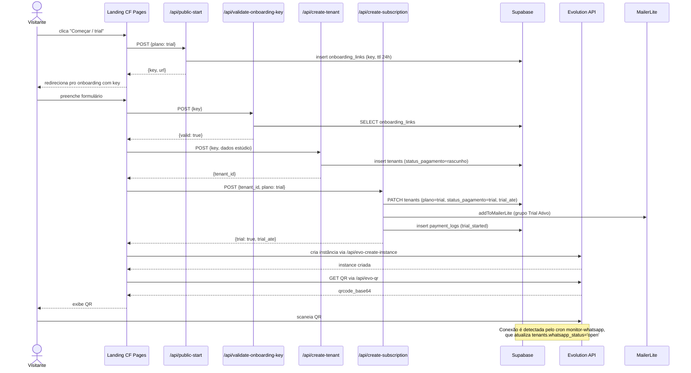
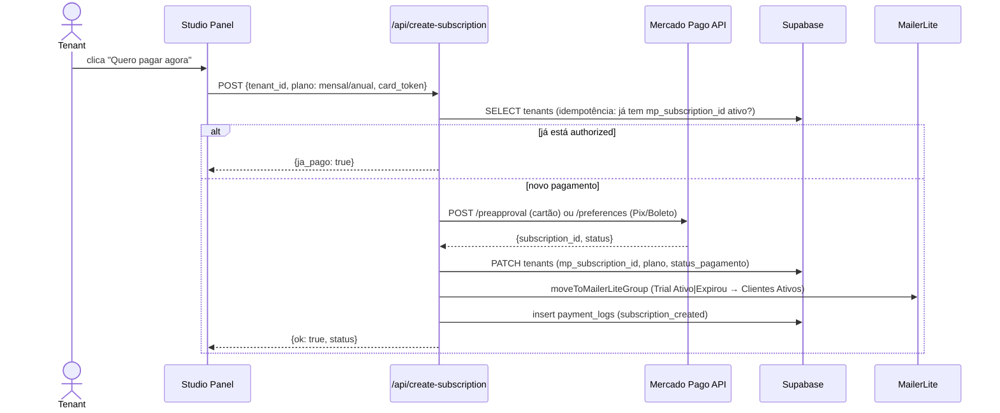
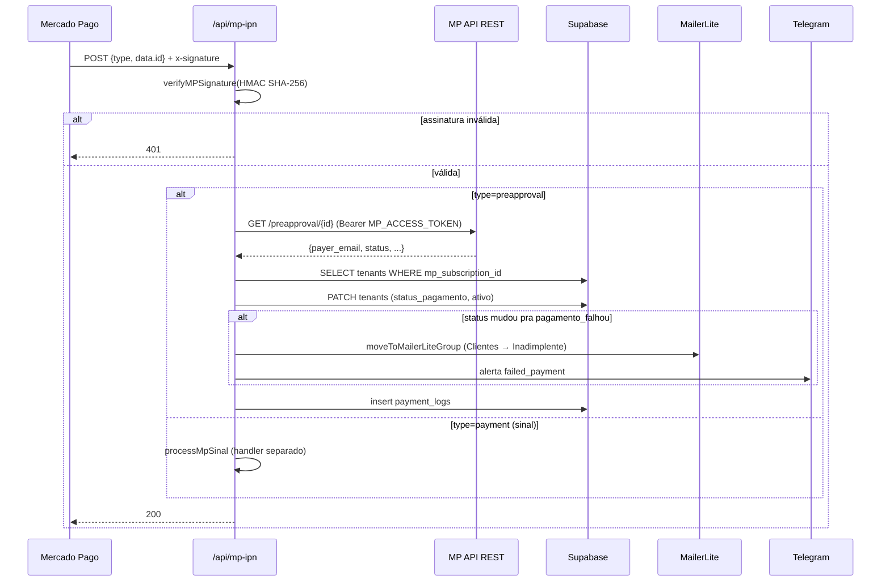
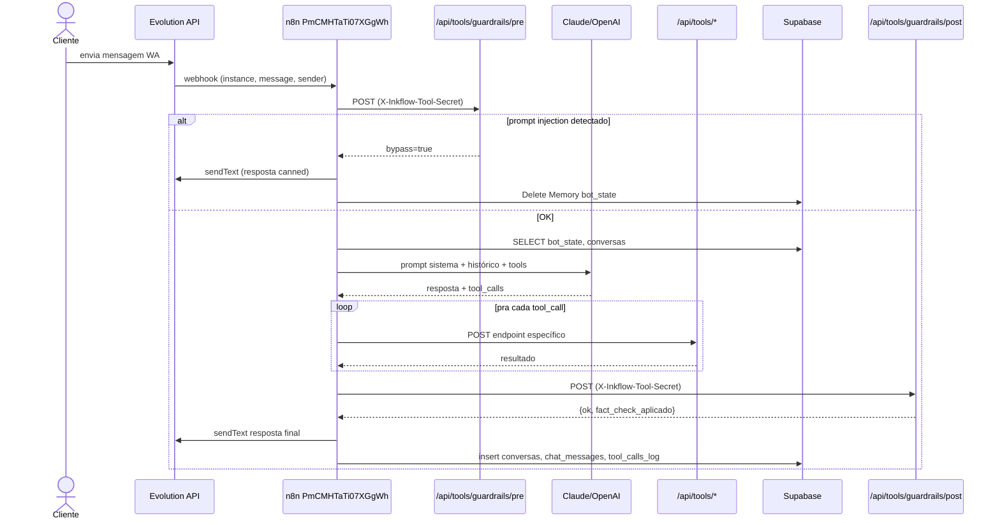
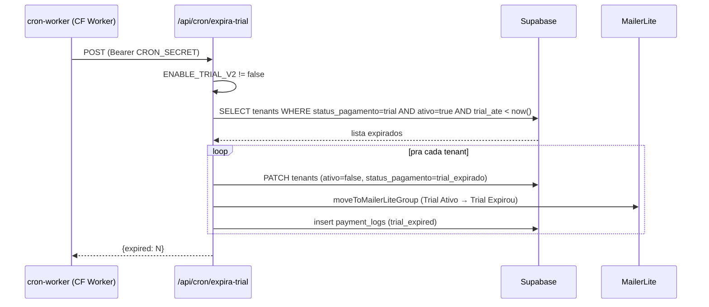
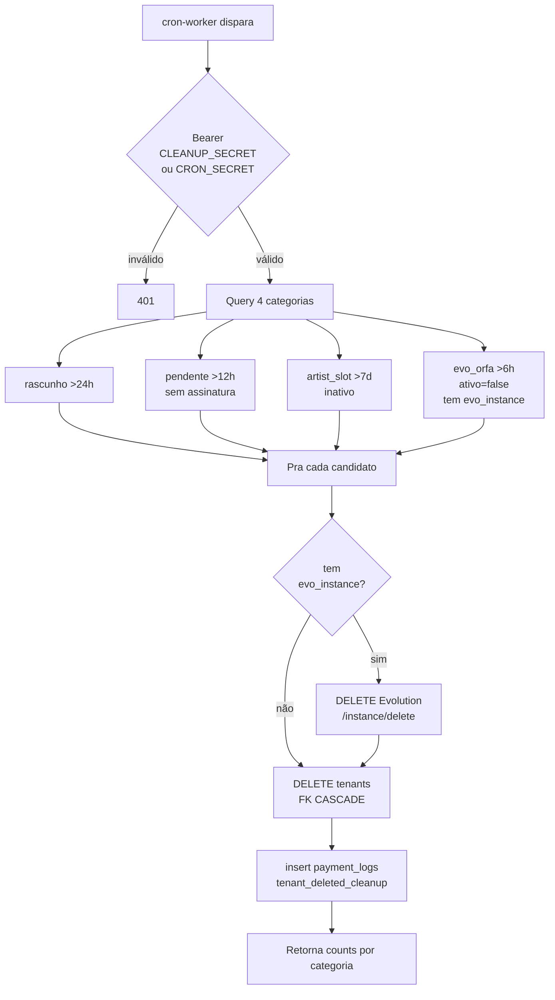
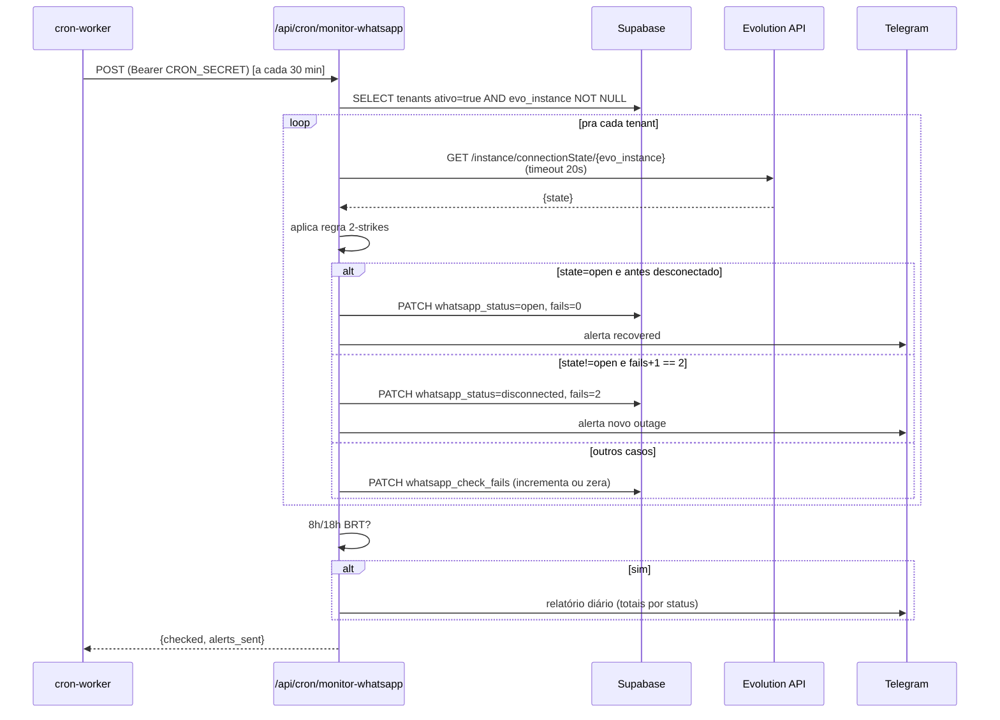
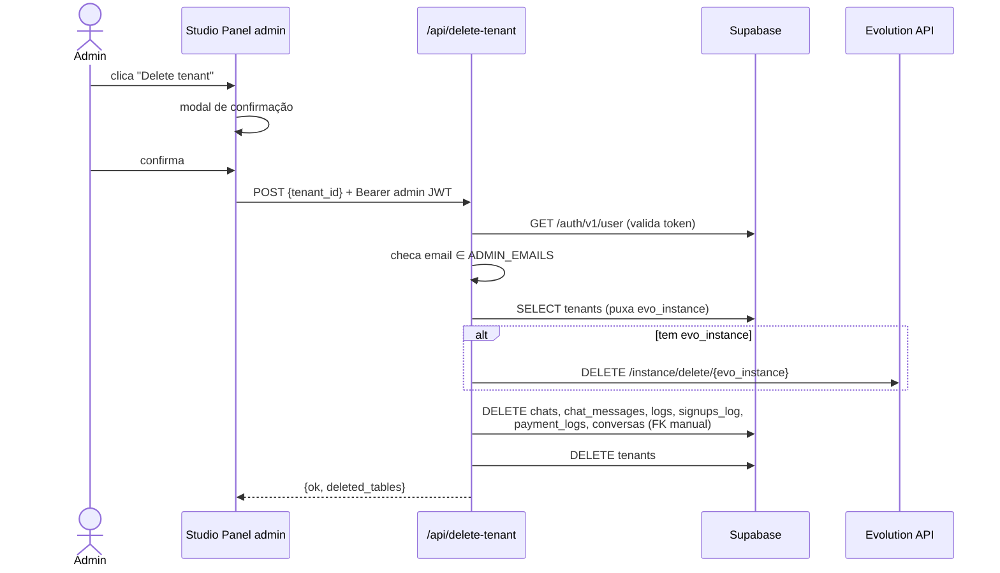

# Mapa Canônico — Fluxos críticos

Fluxos ponta-a-ponta do InkFlow. Cada fluxo tem um diagrama Mermaid + narrativa numerada + pontos de falha conhecidos. Os endpoints exatos vivem em `ids.md` (seção *Endpoints internos*).

## Signup → trial

Visitante chega na landing, clica "Começar", recebe `onboarding_key`, preenche dados de estúdio, conecta WhatsApp via QR. Tenant entra em `status_pagamento='trial'` por 7 dias.

### Passos detalhados

1. Visitante clica CTA "Começar trial" na landing.
2. Landing chama `POST /api/public-start` com `{plano: "trial"}` — endpoint público (Cloudflare WAF rate limit 3 req/10s/IP).
3. `public-start` cria registro em `onboarding_links` com `key=randomUUID()` e TTL 24h, retorna `{key, url}`.
4. Visitante é redirecionado pro onboarding (form), preenche dados.
5. Landing chama `POST /api/validate-onboarding-key` antes de submeter (UX: evita fail tarde).
6. Landing chama `POST /api/create-tenant` com a key + dados → cria registro `tenants` com `status_pagamento='rascunho'`.
7. Landing chama `POST /api/create-subscription` com `{tenant_id, plano: "trial"}`:
   - Calcula `trial_ate` (now + 7 dias).
   - PATCH em `tenants`: `plano='trial'`, `status_pagamento='trial'`, `trial_ate`.
   - Inscreve email no grupo MailerLite "Trial Ativo".
   - Insere em `payment_logs` (tipo `trial_started`).
8. Landing chama `/api/evo-create-instance` (admin) → cria instância nomeada `tenant-<prefix>` na Evolution.
9. Landing chama `/api/evo-qr` → recebe QR code.
10. Visitante scaneia → Evolution detecta conexão.
11. Cron `/api/cron/monitor-whatsapp` (a cada 30 min) faz health check da instância e atualiza `tenants.whatsapp_status`.

### Pontos de falha conhecidos

- **`/api/update-tenant` chamado em vez de `/api/create-subscription`** durante migração: tenant fica em `rascunho`, MailerLite não inscreve, `payment_logs` sem `trial_started`. (Bug histórico — Onda 1 do Modo Coleta.)
- **`ENABLE_TRIAL_V2='false'`** faz `create-subscription` retornar 503 pra plano trial (kill switch). Ver `secrets.md`.
- **Evolution `/instance/create` falha** se `EVO_GLOBAL_KEY` inválido → usuário fica sem QR. Ver `runbooks/outage-wa.md`.
- **WhatsApp não conecta em 6h após criação:** cleanup cron categoria `evo_orfa` deleta tenant + instância Evo (ver fluxo *cleanup-tenants*).
- **Onboarding key reutilizada:** `validate-onboarding-key` rejeita keys já marcadas `used`.

---

## Trial → pago

Tenant em trial converte (antes ou após expirar) chamando `create-subscription` com plano pago. MP cria preapproval recorrente, Supabase atualiza, MailerLite move grupos.

### Passos detalhados

1. Tenant clica "Quero pagar agora" no painel do estúdio (ou link do email MailerLite "Trial Expirou").
2. Painel chama `POST /api/create-subscription` com `{tenant_id, plano, card_token}` (cartão) ou `{plano, redirect_pix}`.
3. Endpoint faz check de idempotência: se tenant já tem `mp_subscription_id` com `status_pagamento='authorized'`, retorna sucesso sem refazer.
4. Pra cartão: chama MP `POST /preapproval` com `MP_ACCESS_TOKEN`.
5. MP retorna `subscription_id` + `status` (`authorized` ou `pending`).
6. Endpoint salva em `tenants.mp_subscription_id`, atualiza `plano` e `status_pagamento`.
7. Endpoint chama `moveToMailerLiteGroup`: remove de "Trial Ativo" / "Trial Expirou", adiciona em "Clientes Ativos".
8. Endpoint registra em `payment_logs` (tipo `subscription_created`).

### Pontos de falha conhecidos

- **Cartão recusado:** MP retorna erro → endpoint propaga ao painel com `{error: 'Cartão recusado'}`.
- **`MP_ACCESS_TOKEN` expirado/revogado:** 401 do MP → endpoint 5xx. Ver `runbooks/mp-webhook-down.md` (mesmo procedure de rotação).
- **MailerLite down:** tenant fica pago mas grupo não muda. Não bloqueia pagamento; fix manual depois.
- **Tenant em estado `rascunho`** (legacy): `create-subscription` rejeita por estado inválido. Limpar via admin.
- **Race entre IPN MP e response:** se IPN chega antes do PATCH local concluir, status pode ser sobrescrito. Mitigação: idempotência por `mp_payment_id` UNIQUE em `payment_logs`.

---

## Payment recorrente (IPN MP)

MP cobra mensalmente. Cada evento gera POST em `/api/mp-ipn`. Endpoint valida HMAC (`MP_WEBHOOK_SECRET`), atualiza `tenants.status_pagamento`, registra em `payment_logs`.

### Passos detalhados

1. MP processa cobrança recorrente na data agendada.
2. Se aprovada/falha: MP envia POST `/api/mp-ipn` com `?data.id=<payment_id>&type=preapproval|payment`.
3. `mp-ipn` valida `x-signature` HMAC SHA-256 com `MP_WEBHOOK_SECRET` (manifest: `id:<data_id>;request-id:<x_req>;ts:<ts>;`).
4. Se `type=preapproval` (assinatura SaaS): busca detalhes via `GET /preapproval/<id>` na MP API.
5. Faz PATCH em `tenants` com novo `status_pagamento` (`authorized` / `paused` / `cancelled` / `pagamento_falhou`).
6. Se mudou pra `pagamento_falhou`: move grupo MailerLite + alerta Telegram.
7. Se `type=payment` com `external_reference` de agendamento: roteia pra `processMpSinal` (handler de sinal de tatuagem). Caso contrário, ignora.
8. Insere `payment_logs` e retorna 200.

### Pontos de falha conhecidos

- **Webhook não chega** (MP delivery falhou ou nossa URL fora): ver `runbooks/mp-webhook-down.md`.
- **Assinatura inválida:** endpoint retorna 401, MP retenta até 5x. Causa comum: `MP_WEBHOOK_SECRET` desalinhado entre painel MP e CF Pages env.
- **Schema desalinhado em `payment_logs`:** insert falha → 5xx → ver `runbooks/rollback.md`.
- **Race com 2 IPNs simultâneos pro mesmo payment:** mitigado por idempotência via `mp_payment_id`.
- **`type=payment` sem `external_reference`:** ignorado silenciosamente — gap conhecido se MP enviar formato novo.

---

## Webhook Evolution → n8n → bot

Cliente final manda mensagem WA pro tenant. Evolution recebe → webhook configurado dispara workflow n8n principal → guardrails + Claude/OpenAI + tools → resposta volta via Evolution.

### Passos detalhados

1. Cliente envia mensagem ao número WhatsApp do tenant.
2. Evolution recebe → triggera webhook configurado pra essa instância (URL aponta direto pro n8n).
3. Workflow n8n principal `MEU NOVO WORK - SAAS` (id `PmCMHTaTi07XGgWh`) recebe.
4. Workflow chama `/api/tools/guardrails/pre` com `X-Inkflow-Tool-Secret`. Se detectar prompt injection: workflow envia resposta canned via Evolution + limpa `bot_state`.
5. Caso contrário, workflow lê `bot_state` no Supabase (memória curta) e histórico em `conversas`.
6. Workflow chama Claude/OpenAI com prompt do tenant + histórico + ferramentas disponíveis.
7. Para cada tool_call retornado pelo LLM, workflow chama o endpoint correspondente em `/api/tools/*` (ex: `consultar-horarios`, `reservar-horario`, `calcular-orcamento`).
8. Resposta passa por `/api/tools/guardrails/post` (fact-check de preços via node `Apply Fact-Check`).
9. Workflow envia resposta via Evolution `POST /message/sendText/<instance>`.
10. Workflow loga em `conversas`, `chat_messages`, `tool_calls_log`.

### Pontos de falha conhecidos

- **Evolution instance desconectada:** webhook não chega → cron `monitor-whatsapp` detecta (2-strike rule) → alerta Telegram. Ver `runbooks/outage-wa.md`.
- **n8n down:** workflow não executa → mensagens acumulam no Evolution. Sem alerta automático ainda.
- **Claude/OpenAI rate limit:** workflow pode retornar erro silencioso (gap).
- **Guardrails endpoint 5xx:** workflow continua sem proteção (gap — falha aberta).
- **`INKFLOW_TOOL_SECRET` desalinhado entre n8n e CF Pages:** todas as tools retornam 401 → workflow falha.

---

## Cron: expira-trial

Worker `inkflow-cron` dispara `/api/cron/expira-trial` diariamente. Endpoint marca tenants com `trial_ate < now()` como `trial_expirado` e move grupo MailerLite.

### Passos detalhados

1. CF Worker cron schedule dispara (cron schedule no `cron-worker/wrangler.toml`).
2. Worker chama `POST /api/cron/expira-trial` com header `Authorization: Bearer $CRON_SECRET`.
3. Endpoint verifica feature flag `ENABLE_TRIAL_V2` (se `'false'`, retorna 503 sem fazer nada — kill switch).
4. Endpoint valida `CRON_SECRET`.
5. Query: `tenants WHERE status_pagamento='trial' AND ativo=true AND trial_ate < now()`.
6. Pra cada tenant:
   - PATCH `ativo=false`, `status_pagamento='trial_expirado'`.
   - `moveToMailerLiteGroup` (Trial Ativo → Trial Expirou) — dispara email automático MailerLite.
   - Insert `payment_logs` (tipo `trial_expired`).
7. Retorna `{expired: count, results}` ao Worker.
8. Worker loga; sem alerta Telegram automático nesse cron (volume previsível).

### Pontos de falha conhecidos

- **`CRON_SECRET` desalinhado entre Worker e Pages** após rotação parcial → 401. Ver `secrets.md` procedure de rotação.
- **MailerLite API down:** PATCH no Supabase já foi feito → tenants ficam expirados mas grupo não muda. Logs registram `mlOk: false` pra fix manual.
- **`trial_ate` NULL** em registros legacy → query não pega (filtro `lt.now()` exclui NULL). Seed manual se houver.
- **Lock em `tenants` sob carga:** query pode ficar lenta. Mitigação futura: paginação se >100 tenants/cycle.

---

## Cron: cleanup-tenants

Endpoint deleta tenants órfãos em 4 categorias e limpa instância Evolution correspondente. Cascata via FK CASCADE no Supabase + DELETE explícito na Evolution.

### Passos detalhados

1. Worker chama `POST /api/cleanup-tenants` com `Authorization: Bearer <CLEANUP_SECRET ou CRON_SECRET>`.
2. Endpoint valida secret (aceita ambos os nomes).
3. Identifica candidatos em 4 queries Supabase:
   - **(1)** `tenants` em `rascunho` há >24h.
   - **(2)** `tenants` em `pendente` há >12h, `ativo=false`, sem `mp_subscription_id`.
   - **(3)** `tenants` em `artist_slot` há >7d, `ativo=false`.
   - **(4)** `tenants` `evo_orfa`: `ativo=false`, tem `evo_instance`, criado há >6h (capturou pagamento/trial mas nunca conectou WA).
4. Pra cada candidato:
   - Se tem `evo_instance`: chama `DELETE {evo_base_url}/instance/delete/<instance>` com `EVO_GLOBAL_KEY`.
   - `DELETE FROM tenants WHERE id=<id>` no Supabase. FKs CASCADE limpam: `payment_logs`, `conversas`, `chat_messages`, `chats`, `agendamentos`, `tool_calls_log`, `dados_cliente`, `logs`, `signups_log`.
5. Insert `payment_logs` (tipo `tenant_deleted_cleanup`) — sobrevive ao DELETE porque payment_logs do tenant deletado já foi removido junto; o log fica em registro separado de auditoria via tenant_id NULL ou em outra tabela (verificar implementação).
6. Retorna 200 com `counts` por categoria.

### Pontos de falha conhecidos

- **Evolution `DELETE` falha** (instância já deletada / 404): tratar como sucesso (idempotente).
- **MP subscription órfã:** se tenant cancelado tem `mp_subscription_id` ativo, MP continua tentando cobrar. Cleanup atual não cancela MP — gap. Mitigação: rota separada `/api/delete-tenant` (admin) já cancela MP; cleanup automático ainda não.
- **Race com tenant conectando WA "agora"** na categoria evo_orfa: query usa `created_at > 6h`, não considera `updated_at`. Mitigação: adicionar `AND updated_at < now() - interval '6h'`.
- **FK CASCADE não cobre Storage Supabase** (se houver buckets com arquivos do tenant): cleanup manual via SQL.

---

## Cron: monitor-whatsapp

Health check de cada instância Evolution. Regra 2-strikes evita flap. Alerta Telegram em outage confirmado, recuperação, e relatório diário.

### Passos detalhados

1. Worker chama `POST /api/cron/monitor-whatsapp` com `CRON_SECRET` (frequência configurada no cron-worker, 30 min).
2. Endpoint valida secret.
3. Query: `tenants` com `ativo=true` e `evo_instance NOT NULL`. Lê também `whatsapp_status`, `whatsapp_check_fails`, `whatsapp_status_changed_at`.
4. Pra cada tenant: `GET {evo_base_url}/instance/connectionState/<evo_instance>` com `apikey: <evo_apikey>` (timeout 20s).
5. Aplica regra 2-strikes:
   - `state='open'` e antes `disconnected`: PATCH `whatsapp_status='open'`, `whatsapp_check_fails=0` + alerta Telegram "recovered".
   - `state!='open'` e `fails+1 == FAIL_THRESHOLD (2)`: PATCH `whatsapp_status='disconnected'`, `fails=2` + alerta Telegram "novo outage".
   - Demais: incrementa ou zera `whatsapp_check_fails`.
6. Em horários de relatório (8h/18h BRT): envia summary diário ao Telegram com totais por status.
7. Retorna 200 com `{checked, alerts_sent}`.

### Pontos de falha conhecidos

- **Evolution API down:** todos os checks retornam null → endpoint detecta padrão e envia 1 alerta Telegram "Evolution API unreachable" (não spam).
- **`evo_apikey` inválido por tenant:** falha 401 individual → soma como strike.
- **`TELEGRAM_BOT_TOKEN/CHAT_ID` ausentes:** alerta loga warn e segue (não bloqueia checks).
- **Tenant deletado via cleanup mas `ativo=true` ainda:** filtro inicial pega → query lenta com tenants stale. Limpar com cleanup-tenants.
- **Telegram rate limit (30 msg/sec):** alertas individuais podem batchear se >30 tenants afetados; gap atual não tem batch.

---

## Delete-tenant cascata (admin manual)

Founder/admin deleta tenant via painel ou API. Cascata: Evolution + Supabase. (MP cancel não-implementado ainda — gap.)

### Passos detalhados

1. Admin loga no painel, escolhe tenant, clica "Delete".
2. Modal confirma o que será apagado.
3. Admin confirma → painel chama `POST /api/delete-tenant` com `{tenant_id}` + `Authorization: Bearer <JWT do Supabase Auth>`.
4. Endpoint valida JWT via `GET {SUPABASE_URL}/auth/v1/user`.
5. Verifica `user.email ∈ ADMIN_EMAILS` (hardcoded `['lmf4200@gmail.com']`).
6. Endpoint busca tenant pra obter `evo_instance` antes de deletar.
7. Se tem `evo_instance`: `DELETE {evo_base_url}/instance/delete/<instance>` com `EVO_GLOBAL_KEY`.
8. DELETEs explícitos em ordem: `chats`, `chat_messages`, `logs`, `signups_log`, `payment_logs`, `conversas` (helper `del()` interno).
9. `DELETE FROM tenants WHERE id=...`.
10. Retorna `{ok, deleted_tables}` ao painel.

### Pontos de falha conhecidos

- **MP subscription órfã:** endpoint atual NÃO cancela `mp_subscription_id` no MP → cobrança continua. Workaround: founder cancela manual no MP dashboard ANTES de deletar. Gap conhecido.
- **Evolution `DELETE` falha** mid-cascade (404 já deletada / 5xx): handler segue (idempotente). Instance órfã consome RAM no VPS — cleanup manual SSH.
- **JWT expirado:** 401 → admin precisa relogar.
- **Cascata atômica não-garantida** entre 3 sistemas externos. Hoje é "best-effort" com log step-a-step. Saga pattern é roadmap.
- **ADMIN_EMAILS hardcoded:** adicionar admin novo requer deploy. Mover pra env var futuramente.
