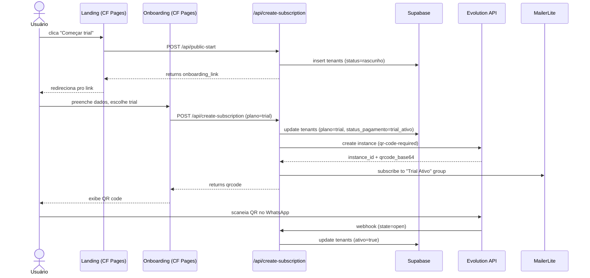

# Mapa Canônico — Implementation Plan

> **For agentic workers:** REQUIRED SUB-SKILL: Use `superpowers:subagent-driven-development` (recommended) or `superpowers:executing-plans` to implement this plan task-by-task. Steps use checkbox (`- [ ]`) syntax for tracking.

**Goal:** Construir o Mapa Canônico v1 — 13 arquivos em `inkflow-saas/docs/canonical/` que servem como única fonte-da-verdade técnica do InkFlow para os agents do Sub-projeto 2 (Time de Subagents MVP).

**Architecture:** 7 arquivos planos (`index/stack/flows/ids/secrets/limits.md` + pasta `runbooks/` com `README + 6 runbooks`). Source-of-truth híbrido: duplica conteúdo narrativo, referencia conteúdo técnico-vivo (`wrangler.toml`, migrations, `.env.example`). Vault Obsidian recebe **notas-âncora** curtas (TL;DR + ponteiro pro repo). Trabalho organizado em 2 ondas internas — Onda 1 (essencial pra Sub-projeto 2) → Onda 2 (completa as 6 áreas do spec-mestre) → notas-âncora → DoD test → 1 PR pra `main`.

**Tech Stack:** Markdown + frontmatter YAML; Mermaid em ` ```mermaid ` blocks pros fluxos; bash one-liners pra verificação estrutural; git pra checkpointing por arquivo.

**Spec base:** [`docs/superpowers/specs/2026-04-26-mapa-canonico-design.md`](../specs/2026-04-26-mapa-canonico-design.md) (commit `ab4c79d` na branch `feat/mapa-canonico`).

**Branch:** `feat/mapa-canonico` (já criada, partindo de `main` em `01c1466`).

---

## Riscos a vigiar durante a execução

| Risco | Mitigação |
|---|---|
| **Vazamento de secrets** ao escrever `secrets.md` | NUNCA fazer `Read` em `.env`, `~/.zshrc`, ou wrangler-pages-env-output. Listar APENAS nomes (vindos de `wrangler.toml [vars]` e do conhecimento estrutural). Validação: `grep -E "(sk-|APP_USR|eyJ|password=)" docs/canonical/secrets.md` deve retornar 0 hits. |
| **Mermaid syntax inválido** em `flows.md` | Após escrever cada diagrama, copiar pro mermaid.live (ou validador local) e confirmar render. Se não houver acesso visual, usar exemplos canônicos do mermaid docs. |
| **Comandos copy-paste obsoletos** nos runbooks | Cada runbook deve ser **executado pelo menos 1x em modo dry-run** durante implementação (sem efeito destrutivo). Para destrutivos (rollback, delete), simular em ambiente de teste ou validar sintaxe via `--help`. |
| **Conflito de edição vault Obsidian** durante anchor notes | Avisar Leandro antes de tocar nas 3 notas; se vault tiver sync ativo (Obsidian Sync, iCloud), pausar sync brevemente OU validar no fim que arquivos batem. |
| **Drift do plano vs spec durante execução** | Ao fim de cada Onda, rodar diff entre estrutura final do `docs/canonical/` e §3.1 do spec. Qualquer divergência justificada vira nota no commit message. |
| **PR muito grande** (≥1500 linhas) dificulta review | Aceitar — DoD do spec exige tudo junto na v1. Mitigação: commit-por-arquivo deixa diff reviewable file-by-file. |

---

## Mapa de arquivos (criados/modificados)

**Criados em `inkflow-saas/docs/canonical/`:**

| # | Arquivo | Onda | Tarefa |
|---|---|---|---|
| 1 | `index.md` | 1 + final touch | Task 1 (skeleton) + Task 11 (final) |
| 2 | `stack.md` | 1 | Task 2 |
| 3 | `ids.md` | 1 | Task 3 |
| 4 | `secrets.md` | 1 | Task 4 |
| 5 | `runbooks/README.md` | 1 | Task 5 |
| 6 | `runbooks/deploy.md` | 1 | Task 5 |
| 7 | `runbooks/rollback.md` | 1 | Task 5 |
| 8 | `flows.md` | 2 | Task 7 |
| 9 | `limits.md` | 2 | Task 8 |
| 10 | `runbooks/outage-wa.md` | 2 | Task 9 |
| 11 | `runbooks/mp-webhook-down.md` | 2 | Task 9 |
| 12 | `runbooks/db-indisponivel.md` | 2 | Task 10 |
| 13 | `runbooks/restore-backup.md` | 2 | Task 10 |

**Modificados no vault Obsidian** (`/Users/brazilianhustler/.claude/projects/-Users-brazilianhustler/memory/`):

| # | Arquivo | Vira | Tarefa |
|---|---|---|---|
| 14 | `InkFlow — Arquitetura.md` | nota-âncora de `stack.md` + `flows.md` | Task 12 |
| 15 | `InkFlow — Links e IDs.md` | nota-âncora de `ids.md` | Task 12 |
| 16 | `InkFlow — Como publicar.md` | nota-âncora de `runbooks/deploy.md` | Task 12 |

---

## Frontmatter padrão (todos os arquivos do canonical)

```yaml
---
last_reviewed: 2026-04-26
owner: leandro
status: stable
related: [stack.md, runbooks/deploy.md]
---
```

Campos: `last_reviewed` (alvo do auditor `doc-freshness` pós-MVP), `owner`, `status` (`stable | wip | deprecated`), `related` (cross-refs internos do canonical).

---

## Convenção de commit por arquivo

Cada arquivo do canonical → 1 commit dedicado. Mensagem padrão:

```
docs(canonical): adiciona <arquivo> (Onda N)

<1-2 frases descrevendo o conteúdo>

Sub-projeto 1 — Mapa Canônico v1.
Spec: docs/superpowers/specs/2026-04-26-mapa-canonico-design.md
```

---

## Task 1: Setup — diretório, frontmatter pattern e index.md skeleton

**Files:**
- Create: `docs/canonical/` (directory)
- Create: `docs/canonical/runbooks/` (directory)
- Create: `docs/canonical/index.md` (skeleton — final preenchido em Task 11)

- [ ] **Step 1: Confirmar branch e estado limpo**

```bash
git branch --show-current     # esperado: feat/mapa-canonico
git status                     # esperado: branch limpa exceto untracked já existentes
```

- [ ] **Step 2: Criar diretórios**

```bash
mkdir -p docs/canonical/runbooks
ls -la docs/canonical/         # confirma 'runbooks/' criado
```

- [ ] **Step 3: Escrever `docs/canonical/index.md` skeleton**

Conteúdo do arquivo:

````markdown
---
last_reviewed: 2026-04-26
owner: leandro
status: wip
related: []
---
# Mapa Canônico do InkFlow — Index

> Este arquivo é embutido literalmente no system prompt dos agents do Sub-projeto 2.
> Antes de qualquer ação irreversível em produção, agent consulta o runbook relevante.

## Convenções para agents

- **Source-of-truth:** este Mapa é canonical. Quando há divergência entre Mapa e arquivo de config (`wrangler.toml`, migration), o **arquivo de config é a verdade técnica**; o Mapa é a verdade narrativa. Se notar divergência, reporta ao founder via Telegram.
- **Secrets:** valores de secrets NUNCA estão neste repo. Ver `secrets.md` para nomes e procedure de obtenção.
- **Antes de ações destrutivas:** consultar runbook correspondente em `runbooks/<incidente>.md`.

## Arquivos disponíveis

_Será preenchido em Task 11 quando todos os arquivos existirem._

## Runbooks disponíveis

_Será preenchido em Task 11._
````

- [ ] **Step 4: Verificar estrutura criada**

```bash
ls -la docs/canonical/
ls -la docs/canonical/runbooks/  # esperado: vazio (será preenchido nas tasks de runbook)
head -20 docs/canonical/index.md
```

- [ ] **Step 5: Commit**

```bash
git add docs/canonical/
git commit -m "docs(canonical): setup diretorio + index.md skeleton (Onda 1)

Cria estrutura inicial do Mapa Canonico. index.md tem frontmatter
padrao + secao de convencoes para agents. Sera preenchido por completo
em task final apos todos os arquivos do canonical existirem.

Sub-projeto 1 — Mapa Canonico v1.
Spec: docs/superpowers/specs/2026-04-26-mapa-canonico-design.md"
```

---

## Task 2: `stack.md` — serviços e suas responsabilidades

**Files:**
- Create: `docs/canonical/stack.md`
- Reference (read-only): `wrangler.toml`, `package.json`, `supabase/migrations/`, vault note `InkFlow — Arquitetura.md`, `InkFlow — Mapa geral.md`

- [ ] **Step 1: Pesquisar dados-fonte (sem ler secrets)**

```bash
cat wrangler.toml                                  # bindings + vars (não tem valores de secret)
ls supabase/migrations/                            # lista de migrations (referência pra schema)
cat package.json | jq '.dependencies, .scripts'    # versão dos SDKs principais
```

E ler (via Read tool) as notas Obsidian: `InkFlow — Arquitetura`, `InkFlow — Mapa geral`, `InkFlow — Links e IDs` para extrair URLs e IDs.

- [ ] **Step 2: Definir contrato estrutural**

`stack.md` deve ter `## <Serviço>` para cada um destes 8 serviços, em ordem:

1. Cloudflare Pages (frontend + API endpoints)
2. Cloudflare Workers (`inkflow-cron`)
3. Supabase (backend de dados + auth)
4. Evolution API (WhatsApp messaging — Vultr VPS)
5. Mercado Pago (billing recorrente)
6. MailerLite (transactional + automation emails)
7. n8n (workflow do bot WhatsApp)
8. Telegram (alertas)

Cada `## <Serviço>` deve ter os seguintes `###` subsections (mesma ordem em todos):
- `### Propósito` (1-2 frases)
- `### URL principal` (link)
- `### Owner` (founder, externo, etc.)
- `### Pontos de integração` (com quem conversa)
- `### Config técnica` (link pro arquivo: `wrangler.toml`, `supabase/migrations/`, etc.)
- `### Health check` (como verificar que está vivo — comando ou URL)

- [ ] **Step 3: Escrever `docs/canonical/stack.md`**

Estrutura (preencher cada `[descrever]` com conteúdo real baseado na pesquisa do Step 1):

````markdown
---
last_reviewed: 2026-04-26
owner: leandro
status: stable
related: [flows.md, ids.md, runbooks/deploy.md]
---
# Mapa Canônico — Stack Técnica

Inventário dos serviços que compõem o InkFlow. Para detalhes técnicos vivos (bindings, env vars, schema), seguir os links na seção `Config técnica` de cada serviço.

## Cloudflare Pages

### Propósito
[Frontend HTML estático + endpoints `/api/*` (Pages Functions). Hospeda landing, onboarding, admin panel.]

### URL principal
- Produção: `https://inkflowbrasil.com`
- Pages dashboard: `https://dash.cloudflare.com/<account>/pages/view/inkflow-saas`

### Owner
Leandro (founder)

### Pontos de integração
- → Supabase (via `SUPABASE_SERVICE_KEY` em endpoints)
- → Mercado Pago (via `MP_ACCESS_TOKEN` em `/api/create-subscription`)
- → Evolution API (via `EVO_GLOBAL_KEY` em `/api/tools/*`)
- → MailerLite (via `MAILERLITE_API_KEY`)
- ← Cloudflare Worker `inkflow-cron` (via `CRON_SECRET`)

### Config técnica
- Bindings + env vars: ver `wrangler.toml` (no repo root) e dashboard Pages
- `.env.example` lista vars mínimas
- Endpoints code: `functions/api/`

### Health check
```bash
curl -s -o /dev/null -w "%{http_code}\n" https://inkflowbrasil.com/
# Esperado: 200
```

---

## Cloudflare Workers

### Propósito
Worker `inkflow-cron` dispatcha rotinas agendadas (expira-trial, cleanup-tenants, reset-agendamentos, monitor-wa) chamando endpoints `/api/cron/*` em CF Pages.

### URL principal
- Worker: `https://inkflow-cron.<subdomain>.workers.dev`
- Code: `workers/inkflow-cron/` (ou path real do worker no repo)

### Owner
Leandro

### Pontos de integração
- → CF Pages `/api/cron/*` (com `CRON_SECRET` no header)
- → Telegram (alertas de falha)

### Config técnica
- Schedule + bindings: ver `wrangler.toml` do worker (path: `workers/inkflow-cron/wrangler.toml`)
- Logs em produção: Cloudflare dashboard → Workers → inkflow-cron → Logs

### Health check
```bash
# Última execução com sucesso (via CF dashboard ou API)
wrangler tail inkflow-cron --format=pretty
```

---

## Supabase

### Propósito
[Banco de dados Postgres + auth + storage. Tabelas principais: `tenants`, `payment_logs`, `conversas`, `agendamentos`, `tool_calls_log`, `chat_messages`, `bot_state`.]

### URL principal
- Project: `https://bfzuxxuscyplfoimvomh.supabase.co`
- Dashboard: `https://supabase.com/dashboard/project/bfzuxxuscyplfoimvomh`

### Owner
Leandro

### Pontos de integração
- ← CF Pages (server-side via `SUPABASE_SERVICE_KEY`)
- ← n8n workflow (via auth token)

### Config técnica
- Schema: ver `supabase/migrations/` (cada migration descreve mudança)
- RLS policies: `supabase/migrations/*_security_*.sql`
- Functions: `supabase/migrations/*_functions_*.sql`

### Health check
```bash
curl -s -o /dev/null -w "%{http_code}\n" \
  -H "apikey: $SUPABASE_ANON_KEY" \
  https://bfzuxxuscyplfoimvomh.supabase.co/rest/v1/
# Esperado: 200 (com SUPABASE_ANON_KEY válido — obter via Bitwarden ou wrangler pages secret list)
```

---

## Evolution API

### Propósito
[Servidor de mensagens WhatsApp self-hosted. Cada tenant tem 1 instância Evo. Webhooks chegam via Evo → n8n → Claude.]

### URL principal
- API: `https://evolution.inkflowbrasil.com` (ou path real)
- Hospedagem: Vultr VPS

### Owner
Leandro

### Pontos de integração
- ← CF Pages (via `EVO_GLOBAL_KEY` para criar/deletar instâncias)
- → n8n (via webhook ao receber mensagem)
- ← n8n (via `EVO_<TENANT>_APIKEY` para enviar mensagem)

### Config técnica
- Instância "central": `EVO_CENTRAL_INSTANCE` + `EVO_CENTRAL_APIKEY` (CF Pages env)
- Instâncias por tenant: criadas dinamicamente, secrets em Supabase `tenants.evo_apikey`

### Health check
```bash
curl -s "https://evolution.inkflowbrasil.com/instance/connectionState/central" \
  -H "apikey: $EVO_GLOBAL_KEY" | jq '.state'
# Esperado: "open"
```

---

## Mercado Pago

### Propósito
[Billing recorrente — subscriptions com cobrança mensal. Webhook em `/api/mp-webhook` notifica eventos.]

### URL principal
- API: `https://api.mercadopago.com`
- Dashboard: `https://www.mercadopago.com.br/developers/panel`

### Owner
Leandro

### Pontos de integração
- ← CF Pages `/api/create-subscription` (via `MP_ACCESS_TOKEN`)
- → CF Pages `/api/mp-webhook` (eventos: subscription created, payment approved, etc.)

### Config técnica
- Token: `MP_ACCESS_TOKEN` (CF Pages env, ver `secrets.md`)
- Plans (preço): definidos em `functions/_lib/plans.js`
- Rate limits: ver docs MP (linka)

### Health check
```bash
curl -s -H "Authorization: Bearer $MP_ACCESS_TOKEN" \
  https://api.mercadopago.com/users/me | jq '.id'
# Esperado: ID numérico do usuário
```

---

## MailerLite

### Propósito
[Email transactional + automations (Trial Ativo / Trial Expirou / Clientes Ativos). 3 grupos sincronizados via API.]

### URL principal
- API: `https://connect.mailerlite.com/api/`
- Dashboard: `https://dashboard.mailerlite.com/`

### Owner
Leandro

### Pontos de integração
- ← CF Pages (via `MAILERLITE_API_KEY` em `/api/*`)

### Config técnica
- 3 group IDs: `MAILERLITE_GROUP_TRIAL_ATIVO`, `MAILERLITE_GROUP_TRIAL_EXPIROU`, `MAILERLITE_GROUP_CLIENTES_ATIVOS` (CF Pages env)
- Lib: `functions/_lib/mailerlite.js`

### Health check
```bash
curl -s -H "Authorization: Bearer $MAILERLITE_API_KEY" \
  https://connect.mailerlite.com/api/groups | jq '.data | length'
# Esperado: ≥3
```

---

## n8n

### Propósito
[Workflow orchestration do bot WhatsApp. Workflow principal "MEU NOVO WORK - SAAS" (id `PmCMHTaTi07XGgWh`).]

### URL principal
- App: `https://n8n.inkflowbrasil.com`
- MCP: `https://n8n.inkflowbrasil.com/mcp-server/http`

### Owner
Leandro

### Pontos de integração
- ← Evolution API (via webhook receber mensagem)
- → CF Pages `/api/tools/guardrails/{pre,post}` (guardrails)
- → Claude/OpenAI (via API key)
- → Supabase (via auth token)

### Config técnica
- Workflows hospedados no servidor n8n (Vultr)
- Detalhes via MCP `n8n` (já configurado em `claude mcp list`)
- 4 workflows secundários migrados pra `inkflow-cron` em 21-22/04 (manter desativados como backup ≥28/04)

### Health check
```bash
curl -s -o /dev/null -w "%{http_code}\n" https://n8n.inkflowbrasil.com/
# Esperado: 200
```

---

## Telegram

### Propósito
Canal de alertas: incidentes, deploys, rotações de secret. Bidirecional (recebe aprovações).

### URL principal
- Bot: configurado via `TELEGRAM_BOT_TOKEN`
- Chat alvo: `TELEGRAM_CHAT_ID`

### Owner
Leandro

### Pontos de integração
- ← CF Worker `inkflow-cron` (envia alertas)
- ← CF Pages (envia alertas críticos)
- ← Auditores (Sub-projeto 3)

### Config técnica
- Token: `TELEGRAM_BOT_TOKEN` (CF Pages + Worker env)
- Chat ID: `TELEGRAM_CHAT_ID` (CF Pages + Worker env)

### Health check
```bash
curl -s "https://api.telegram.org/bot$TELEGRAM_BOT_TOKEN/getMe" | jq '.ok'
# Esperado: true
```
````

- [ ] **Step 4: Verificação estrutural**

```bash
required=("Cloudflare Pages" "Cloudflare Workers" "Supabase" "Evolution API" "Mercado Pago" "MailerLite" "n8n" "Telegram")
for s in "${required[@]}"; do
  grep -q "^## $s" docs/canonical/stack.md && echo "OK: $s" || echo "MISSING: $s"
done
# Esperado: 8 linhas "OK: <serviço>", 0 "MISSING"

# Verificar subseções obrigatórias em cada serviço
for sub in "### Propósito" "### URL principal" "### Owner" "### Pontos de integração" "### Config técnica" "### Health check"; do
  count=$(grep -c "^$sub" docs/canonical/stack.md)
  [ "$count" = "8" ] && echo "OK: $sub ($count)" || echo "WRONG: $sub ($count, esperado 8)"
done
# Esperado: 6 linhas "OK: <subsection> (8)"
```

- [ ] **Step 5: Commit**

```bash
git add docs/canonical/stack.md
git commit -m "docs(canonical): adiciona stack.md (Onda 1)

Inventario dos 8 servicos do InkFlow (CF Pages, CF Workers, Supabase,
Evolution, MP, MailerLite, n8n, Telegram). Cada secao tem proposito,
URL, owner, pontos de integracao, link pra config tecnica e comando
de health check. Sigue padrao SoT hibrido (referencia wrangler.toml
e migrations em vez de duplicar).

Sub-projeto 1 — Mapa Canonico v1.
Spec: docs/superpowers/specs/2026-04-26-mapa-canonico-design.md"
```

---

## Task 3: `ids.md` — IDs e referências

**Files:**
- Create: `docs/canonical/ids.md`
- Reference: `InkFlow — Links e IDs` (vault), `supabase/migrations/`, MCP n8n (lista workflows), `wrangler.toml`

- [ ] **Step 1: Pesquisar IDs reais**

```bash
ls supabase/migrations/ | head -50  # principais migrations e tabelas
cat wrangler.toml | grep -E "vars|name|account_id"
```

E buscar via Read na nota `InkFlow — Links e IDs` (vault) os IDs já documentados (n8n workflow id, Supabase project, CF account, Evo instance id, MP subscription samples).

- [ ] **Step 2: Definir contrato estrutural**

`ids.md` deve ter os seguintes `## <Categoria>`:

1. `## IDs de domínio` — tabela com colunas `Nome | Formato | Exemplo | Onde usado`
2. `## Tabelas Supabase` — tabela com colunas `Tabela | Propósito | Migration de criação`
3. `## Workflows n8n` — tabela com colunas `Nome | ID | Status | MCP path`
4. `## Group IDs MailerLite` — tabela com colunas `Group | ID | Propósito`
5. `## Endpoints internos` — tabela com colunas `Endpoint | Método | Auth | Propósito`

- [ ] **Step 3: Escrever `docs/canonical/ids.md`**

````markdown
---
last_reviewed: 2026-04-26
owner: leandro
status: stable
related: [stack.md, secrets.md]
---
# Mapa Canônico — IDs e Referências

Inventário de identificadores estáveis do InkFlow. Para schema completo do Supabase, ver `supabase/migrations/`. Para lista detalhada de secrets, ver `secrets.md`.

## IDs de domínio

| Nome | Formato | Exemplo | Onde usado |
|---|---|---|---|
| `tenant_id` | UUID v4 | `a1b2c3d4-e5f6-7890-abcd-ef0123456789` | `tenants.id`, `payment_logs.tenant_id`, `conversas.tenant_id` (FK em quase tudo) |
| `mp_subscription_id` | string opaca MP (`2c93808...`) | `2c93808495a1b2c30001f2g3h4i5j6k7` | `tenants.mp_subscription_id`, MP API |
| `evo_instance_id` | string custom | `central` ou `tenant-<uuid-prefix>` | `tenants.evo_instance`, Evolution API path |
| `mp_payment_id` | int64 | `1234567890` | `payment_logs.mp_payment_id`, MP webhooks |
| `mailerlite_subscriber_id` | int64 | `123456789` | MailerLite API responses |

## Tabelas Supabase

| Tabela | Propósito | Migration de criação |
|---|---|---|
| `tenants` | Cadastro de estúdios + status billing | `supabase/migrations/<initial>.sql` |
| `payment_logs` | Histórico de eventos de billing (trial_started, payment_approved, etc.) | `supabase/migrations/*payment_logs*.sql` |
| `conversas` | Histórico de conversas com bot WhatsApp | `supabase/migrations/*conversas*.sql` |
| `agendamentos` | Agendamentos extraídos das conversas | `supabase/migrations/*agendamentos*.sql` |
| `tool_calls_log` | Log de chamadas de ferramenta no bot | `supabase/migrations/*tool_calls*.sql` |
| `chat_messages` | Mensagens individuais (input/output) | `supabase/migrations/*chat_messages*.sql` |
| `bot_state` | Estado por conversa (memória de curto prazo) | `supabase/migrations/*bot_state*.sql` |

_Para schema completo de cada tabela, fazer_ `grep -l "create table.*<tabela>" supabase/migrations/*.sql`.

## Workflows n8n

| Nome | ID | Status | MCP path |
|---|---|---|---|
| MEU NOVO WORK - SAAS | `PmCMHTaTi07XGgWh` | ATIVO (workflow principal do bot) | `n8n://workflows/PmCMHTaTi07XGgWh` |
| Expira Trial | `KEO1tJRKpYTxi15E` | DESATIVADO (migrado pra `inkflow-cron` em 21/04) | `n8n://workflows/KEO1tJRKpYTxi15E` |
| Cleanup Tenants | `JuWleItL6kb0x1NO` | DESATIVADO (migrado pra `inkflow-cron`) | `n8n://workflows/JuWleItL6kb0x1NO` |
| Reset Agendamentos | `V2zccb03P9ZUEH3o` | DESATIVADO (migrado pra `inkflow-cron`) | `n8n://workflows/V2zccb03P9ZUEH3o` |
| Monitor WA | `JZF5llQOonKjDxpY` | DESATIVADO (migrado pra `inkflow-cron`) | `n8n://workflows/JZF5llQOonKjDxpY` |

**Nota:** os 4 workflows desativados servem como backup até ≥28/04, depois arquivar e deletar.

### Nodes-chave do workflow principal

| Node | ID | Tipo | Função |
|---|---|---|---|
| Apply Fact-Check | `2c1604c7-c965-4029-99c4-4a747a36ead5` | Set | aplica resultado do fact-checker de preços |
| Guardrails PRE | `b65df60a-6d6c-4881-851e-fc95a2d0a826` | HTTP | chama `/api/tools/guardrails/pre` |
| Guardrails POST | `d37d740d-df43-449a-8b14-bbbce842d586` | HTTP | chama `/api/tools/guardrails/post` |

## Group IDs MailerLite

| Group | ID env var | Propósito |
|---|---|---|
| Trial Ativo | `MAILERLITE_GROUP_TRIAL_ATIVO` | tenants em trial 7d |
| Trial Expirou | `MAILERLITE_GROUP_TRIAL_EXPIROU` | tenants que não converteram |
| Clientes Ativos | `MAILERLITE_GROUP_CLIENTES_ATIVOS` | tenants pagantes |

_Valores numéricos dos IDs vivem em CF Pages env vars (ver dashboard ou `wrangler pages secret list`)._

## Endpoints internos

| Endpoint | Método | Auth | Propósito |
|---|---|---|---|
| `/api/public-start` | POST | none | cria link de onboarding pra novo tenant |
| `/api/create-subscription` | POST | none (validação interna) | cria subscription MP + tenant + Evo instance |
| `/api/update-tenant` | POST | none (validação interna) | atualiza dados de tenant existente |
| `/api/mp-webhook` | POST | MP signature | recebe eventos de billing |
| `/api/cron/expira-trial` | POST | `CRON_SECRET` header | invocado pelo `inkflow-cron` |
| `/api/cron/cleanup-tenants` | POST | `CRON_SECRET` ou `CLEANUP_SECRET` | cleanup órfãos |
| `/api/cron/reset-agendamentos` | POST | `CRON_SECRET` | reset diário |
| `/api/cron/monitor-wa` | POST | `CRON_SECRET` | monitor WhatsApp |
| `/api/tools/guardrails/pre` | POST | none (chamado por n8n) | injection guardrail |
| `/api/tools/guardrails/post` | POST | none | fact-check preços |
| `/api/tools/acionar-handoff` | POST | none | handoff humano |
| `/api/tools/request-studio-link` | POST | none | gera link onboarding por WA |
| `/api/tools/send-whatsapp-link` | POST | none | envia mensagem via Evo |

## Identificadores externos relevantes

- **Cloudflare Account ID:** `1bea7a6f2e41f53d5687b29ec0bd6fec`
- **Supabase Project ref:** `bfzuxxuscyplfoimvomh`
- **Domínio principal:** `inkflowbrasil.com`
- **n8n MCP:** `https://n8n.inkflowbrasil.com/mcp-server/http`
````

- [ ] **Step 4: Verificação estrutural**

```bash
required=("IDs de domínio" "Tabelas Supabase" "Workflows n8n" "Group IDs MailerLite" "Endpoints internos")
for s in "${required[@]}"; do
  grep -qF "## $s" docs/canonical/ids.md && echo "OK: $s" || echo "MISSING: $s"
done

# Validação anti-leak: ids.md NÃO deve conter valores de secret
grep -E "(sk-|APP_USR-|eyJ[A-Za-z0-9_-]{20,}|[Bb]earer [A-Za-z0-9_-]{20,})" docs/canonical/ids.md && echo "VAZAMENTO!" || echo "OK: sem valores de secret"
```

Esperado: 5 "OK", 0 "MISSING", 1 "OK: sem valores de secret".

- [ ] **Step 5: Commit**

```bash
git add docs/canonical/ids.md
git commit -m "docs(canonical): adiciona ids.md (Onda 1)

Inventario de identificadores estaveis: IDs de dominio (tenant_id,
mp_subscription_id, etc.), tabelas Supabase, workflows n8n com IDs
e status, group IDs MailerLite e endpoints internos. Schema completo
fica em supabase/migrations/ (referenciado, nao duplicado).

Sub-projeto 1 — Mapa Canonico v1."
```

---

## Task 4: `secrets.md` — mapa de secrets (NOMES + ponteiros, ZERO valores)

**Files:**
- Create: `docs/canonical/secrets.md`
- Reference (NÃO ler valores): `wrangler.toml` (apenas chaves de `[vars]`), `.env.example` (lista de vars expected), conhecimento estrutural do projeto

⚠️ **Risco crítico:** Esta task NUNCA pode ler `~/.zshrc`, `.env`, output de `wrangler pages secret list --raw`, ou qualquer arquivo com valores de secret plaintext. Apenas listar **nomes** das chaves.

- [ ] **Step 1: Listar nomes de secrets esperados**

```bash
cat .env.example 2>/dev/null | grep -E "^[A-Z_]+=" | cut -d= -f1
cat wrangler.toml | grep -E "^[a-zA-Z_]+ = " | head -30
```

Anotar os nomes (não os valores). Cross-checar com lista conhecida em `InkFlow — Painel` (seção "💰 Stack atual").

- [ ] **Step 2: Definir contrato estrutural**

`secrets.md` deve ter:

1. `## Tabela master` — colunas: `Nome | Fonte canônica | TTL | Owner | Severidade rotação`
2. `## Por categoria` — agrupar secrets por sistema (Supabase, MP, Evo, MailerLite, Telegram, CF, etc.)
3. `## Procedure de rotação` — uma seção `### Rotacionar <SECRET_NAME>` por secret crítico, com comandos copy-paste
4. `## Onde valores vivem` — tabela das fontes canônicas (Bitwarden / Keychain / CF Pages env / GitHub Secrets / Vultr)

- [ ] **Step 3: Escrever `docs/canonical/secrets.md`**

````markdown
---
last_reviewed: 2026-04-26
owner: leandro
status: stable
related: [stack.md, runbooks/rollback.md]
---
# Mapa Canônico — Secrets

⚠️ **Este arquivo lista APENAS NOMES de secrets e onde encontrar os valores. ZERO valores plaintext aqui.**

Para obter o valor de qualquer secret, ir na fonte canônica indicada (Bitwarden, Keychain, CF Pages env, GitHub Secrets, Vultr). Agents devem usar MCP autenticado (Cloudflare/Supabase/Bitwarden) ou pedir ao founder via Telegram.

## Tabela master

| Nome | Fonte canônica | TTL | Owner | Severidade rotação |
|---|---|---|---|---|
| `SUPABASE_SERVICE_KEY` | Bitwarden item `inkflow-supabase-service-key` + CF Pages env | sem expiry | leandro | crítica |
| `SUPABASE_ANON_KEY` | Bitwarden + CF Pages env | sem expiry | leandro | baixa (chave pública por design) |
| `MP_ACCESS_TOKEN` | Bitwarden item `inkflow-mp-prod` + CF Pages env | sem expiry MP | leandro | crítica |
| `EVO_GLOBAL_KEY` | Bitwarden item `inkflow-evo-global` + CF Pages env | sem expiry | leandro | crítica |
| `EVO_CENTRAL_APIKEY` | Bitwarden + CF Pages env | sem expiry | leandro | alta |
| `MAILERLITE_API_KEY` | Bitwarden item `inkflow-mailerlite` + CF Pages env | sem expiry | leandro | alta |
| `MAILERLITE_GROUP_TRIAL_ATIVO` | CF Pages env (não é secret crítico, é ID público) | sem expiry | leandro | baixa |
| `MAILERLITE_GROUP_TRIAL_EXPIROU` | CF Pages env | sem expiry | leandro | baixa |
| `MAILERLITE_GROUP_CLIENTES_ATIVOS` | CF Pages env | sem expiry | leandro | baixa |
| `TELEGRAM_BOT_TOKEN` | Bitwarden item `inkflow-telegram-bot` + CF Pages + Worker env | sem expiry | leandro | crítica |
| `TELEGRAM_CHAT_ID` | CF Pages + Worker env | sem expiry | leandro | baixa (apenas ID, não secret) |
| `CRON_SECRET` | CF Pages + Worker env | sem expiry | leandro | alta |
| `CLEANUP_SECRET` | CF Pages + Worker env | sem expiry | leandro | alta |
| `CLOUDFLARE_API_TOKEN` | Bitwarden item `cloudflare-agent-token` + GitHub Secrets | 90d | leandro | crítica |

## Por categoria

### Supabase
- `SUPABASE_SERVICE_KEY` — server-side DB write/read
- `SUPABASE_ANON_KEY` — client-side public key

### Mercado Pago
- `MP_ACCESS_TOKEN` — criar/cancelar subscriptions, validar webhooks

### Evolution API
- `EVO_GLOBAL_KEY` — criar/deletar instâncias (admin-level)
- `EVO_CENTRAL_APIKEY` — instância central (operação)
- Por tenant: `tenants.evo_apikey` (Supabase, gerado dinamicamente)

### MailerLite
- `MAILERLITE_API_KEY` — gerenciar grupos + automations
- `MAILERLITE_GROUP_*` — IDs públicos dos grupos (não são secrets, mas convivem com eles)

### Telegram
- `TELEGRAM_BOT_TOKEN` — bot HTTP API
- `TELEGRAM_CHAT_ID` — destino dos alertas

### Cron auth
- `CRON_SECRET` — endpoints `/api/cron/*` validam contra esse header
- `CLEANUP_SECRET` — secondary auth pro cleanup-tenants

### Cloudflare
- `CLOUDFLARE_API_TOKEN` — usado em GHA pra `wrangler pages deploy`

## Onde valores vivem

| Fonte | Quem usa | Como acessar |
|---|---|---|
| **Bitwarden** | founder, agents via MCP autenticado | `bw get item <nome>` (CLI) ou app desktop |
| **Keychain (macOS)** | founder local (zshrc) | `security find-generic-password -s <nome>` |
| **Cloudflare Pages env** | runtime do site em prod | `wrangler pages secret list --project=inkflow-saas` (lista nomes) ou dashboard |
| **Cloudflare Worker env** | runtime do `inkflow-cron` | `wrangler secret list --name=inkflow-cron` |
| **GitHub Secrets** | GHA workflows (deploy) | repo Settings → Secrets and variables → Actions |
| **Supabase** (`tenants.evo_apikey`) | per-tenant Evo keys | query SQL com `SUPABASE_SERVICE_KEY` |
| **Vultr** (env do Evolution VPS) | Evolution API server | SSH → `/etc/evolution/.env` (acesso restrito ao founder) |

## Procedure de rotação

### Rotacionar `MP_ACCESS_TOKEN`

1. **Gerar novo token** no MP dashboard (https://www.mercadopago.com.br/developers/panel → Suas Integrações → InkFlow → Credenciais → Renovar Access Token).
2. **Salvar em Bitwarden** (atualiza item `inkflow-mp-prod`).
3. **Atualizar em CF Pages**:
   ```bash
   cd /Users/brazilianhustler/Documents/inkflow-saas
   echo "<novo-token>" | wrangler pages secret put MP_ACCESS_TOKEN --project-name=inkflow-saas
   ```
   (Comando vai pedir confirmação. Cole o token, Enter.)
4. **Validar:**
   ```bash
   curl -s -H "Authorization: Bearer <novo-token>" https://api.mercadopago.com/users/me | jq '.id'
   # Esperado: ID numérico
   ```
5. **Redeploy** (necessário pra picking up env nova):
   ```bash
   npx wrangler pages deploy . --project-name=inkflow-saas
   ```
6. **Smoke test** em prod: criar trial fake e verificar `payment_logs` registra.
7. **Revogar token antigo** no MP dashboard.
8. **Registrar rotação:** atualizar `last_reviewed` em `secrets.md` + commit.

### Rotacionar `CLOUDFLARE_API_TOKEN`

1. **Criar novo token** em CF dashboard → My Profile → API Tokens. Permissions: `Account.Cloudflare Pages:Edit`. TTL: 90d.
2. **Salvar em Bitwarden** (atualiza `cloudflare-agent-token`).
3. **Atualizar em GitHub Secrets**: repo Settings → Actions → Secrets → `CLOUDFLARE_API_TOKEN` → Update.
4. **Validar:** trigger manual em GHA workflow (Actions tab → Re-run jobs).
5. **Revogar token antigo** no CF dashboard.
6. **Registrar rotação:** atualizar `last_reviewed` + commit.

### Rotacionar `CRON_SECRET` (ou `CLEANUP_SECRET`)

⚠️ **Atomic rotation:** mudar nas DUAS pontas (CF Pages + Worker) sem janela onde só uma das pontas mudou. Senão crons quebram.

1. **Gerar novo secret:** `openssl rand -hex 32`
2. **Salvar em Bitwarden** (criar/atualizar item `inkflow-cron-secret`).
3. **Atualizar Worker primeiro:**
   ```bash
   cd /Users/brazilianhustler/Documents/inkflow-saas/workers/inkflow-cron  # ou path real
   echo "<novo-secret>" | wrangler secret put CRON_SECRET --name=inkflow-cron
   ```
4. **Imediatamente atualizar CF Pages:**
   ```bash
   echo "<novo-secret>" | wrangler pages secret put CRON_SECRET --project-name=inkflow-saas
   ```
5. **Redeploy CF Pages** (Worker já picka env nova após `secret put`):
   ```bash
   npx wrangler pages deploy . --project-name=inkflow-saas
   ```
6. **Validar:** próxima execução do cron (até 6h dependendo do trigger) deve passar.
7. **Registrar rotação.**

### Rotacionar `EVO_GLOBAL_KEY`

⚠️ **Trabalho coordenado** com Vultr VPS (Evolution server). Procedure detalhada em `runbooks/restore-backup.md` seção "Rotação de chave Evo" (a ser escrita).

Esquema:
1. SSH no Vultr Evolution server.
2. Gerar nova `AUTHENTICATION_API_KEY` em `.env`.
3. Restart serviço Evolution.
4. Atualizar `EVO_GLOBAL_KEY` em CF Pages env.
5. Redeploy CF Pages.
6. Validar criando instância de teste.

## Em caso de vazamento

Se um secret vazou (chat, log público, screenshot, repo público):
1. **Revogar imediatamente** na fonte (MP / CF / Telegram BotFather / etc.).
2. **Rotacionar** seguindo procedure acima.
3. **Auditar** uso indevido (CF analytics, Supabase logs, MP transações).
4. **Registrar incidente:** criar nota `incident_inkflow_<data>_secret-leak.md` no vault Obsidian.
5. **Avisar founder via Telegram** (`/incident <secret>`).
````

- [ ] **Step 4: Verificação estrutural + anti-leak**

```bash
# Estrutura
required=("Tabela master" "Por categoria" "Procedure de rotação" "Onde valores vivem")
for s in "${required[@]}"; do
  grep -qF "## $s" docs/canonical/secrets.md && echo "OK: $s" || echo "MISSING: $s"
done

# Anti-leak rigoroso: padrões comuns de tokens
grep -E "(sk-[A-Za-z0-9]{20,}|APP_USR-[A-Za-z0-9_-]{30,}|eyJ[A-Za-z0-9_-]{50,}|xoxb-[0-9]{10,}|ghp_[A-Za-z0-9]{36}|[A-Za-z0-9]{32,}=)" docs/canonical/secrets.md && echo "❌ POSSIVEL VAZAMENTO" || echo "✅ OK: sem padrões de token"

# Anti-leak: nada de "valor: <coisa>"
grep -iE "(value|valor)[: =][^a-z]*[A-Za-z0-9]{20,}" docs/canonical/secrets.md && echo "❌ POSSIVEL VAZAMENTO" || echo "✅ OK"
```

Esperado: 4 "OK" estrutura + 2 "OK" anti-leak.

- [ ] **Step 5: Commit**

```bash
git add docs/canonical/secrets.md
git commit -m "docs(canonical): adiciona secrets.md (Onda 1)

Mapa de secrets — APENAS nomes e ponteiros pra fonte canonica
(Bitwarden, Keychain, CF Pages env, GH Secrets, Vultr). Zero valores
plaintext no repo. Inclui procedure de rotacao para os 4 secrets criticos
(MP, CF API token, CRON_SECRET, EVO).

Casa com regra feedback_nunca_ler_arquivos_com_secrets_plaintext.

Sub-projeto 1 — Mapa Canonico v1."
```

---

## Task 5: Onda 1 runbooks — `runbooks/README.md` + `deploy.md` + `rollback.md`

**Files:**
- Create: `docs/canonical/runbooks/README.md`
- Create: `docs/canonical/runbooks/deploy.md`
- Create: `docs/canonical/runbooks/rollback.md`
- Reference: `InkFlow — Como publicar` (vault), `wrangler.toml`

- [ ] **Step 1: Pesquisar comandos atuais de deploy/rollback**

```bash
cat package.json | jq '.scripts'  # checa se há npm scripts custom
ls .github/workflows/             # GHA pra entender CI
git log --oneline --all -10 -- functions/  # exemplo de mudança recente
```

E ler nota `InkFlow — Como publicar` no vault.

- [ ] **Step 2: Escrever `docs/canonical/runbooks/README.md`**

````markdown
---
last_reviewed: 2026-04-26
owner: leandro
status: stable
related: [../stack.md]
---
# Runbooks — Índice

Cada runbook é um procedimento operacional pra um cenário específico. Use:
1. Identifique o sintoma na tabela abaixo.
2. Abra o runbook correspondente: `Read docs/canonical/runbooks/<nome>.md`.
3. Siga o decision tree.

## Runbooks disponíveis

| Runbook | Sintoma principal | Severidade típica | Tempo estimado |
|---|---|---|---|
| `deploy.md` | rotina (não é incidente) | n/a | 5 min |
| `rollback.md` | deploy quebrou prod | critical | 10 min |
| `outage-wa.md` | mensagens WhatsApp não fluem | critical | 15-60 min |
| `mp-webhook-down.md` | webhook MP parou de chegar (>24h) | critical | 30 min |
| `db-indisponivel.md` | Supabase fora do ar | critical | depende da Supabase |
| `restore-backup.md` | dados corrompidos / preciso restaurar | critical | 1-4h |

## Convenções de runbook

- **Sintomas** → como detectar
- **Pré-requisitos** → credenciais e ferramentas necessárias
- **Diagnóstico** → comandos pra confirmar a causa (com decision tree)
- **Ação** → comandos copy-paste resolvendo, condicionais ao output
- **Verificação** → como confirmar que está resolvido
- **Pós-incidente** → o que registrar (commit, daily note, decisão arquitetural)

## Quando adicionar um runbook novo

Quando um incidente novo acontece e a resposta não é óbvia em 5 min, escrever runbook pra próxima vez. Ciclo:
1. Resolver o incidente (ad-hoc).
2. Logo depois, escrever `runbooks/<nome>.md` com o que funcionou.
3. Atualizar este `README.md` com a nova entrada.
4. Commit + atualizar `last_reviewed` em ambos.
````

- [ ] **Step 3: Escrever `docs/canonical/runbooks/deploy.md`**

````markdown
---
last_reviewed: 2026-04-26
owner: leandro
status: stable
related: [rollback.md, ../stack.md]
---
# Runbook — Deploy padrão (CF Pages + Worker)

Procedimento padrão para deploy de mudanças em produção. **Não é incidente** — é rotina.

## Pré-requisitos

- `wrangler` autenticado (`wrangler whoami` retorna o user)
- `git` com push pra `main` permitido
- `CLOUDFLARE_API_TOKEN` válido (ver `secrets.md`)
- Working tree limpa em `feat/*` ou `main`

## Procedure — CF Pages (frontend + functions)

### 1. Pre-flight checks

```bash
cd /Users/brazilianhustler/Documents/inkflow-saas
git status                                      # esperado: clean
git branch --show-current                       # esperado: feat/* ou main
git log --oneline -5                            # confirma commits que vão deployar
```

### 2. Deploy

```bash
npx wrangler pages deploy . --project-name=inkflow-saas
```

**Output esperado:**
- "Uploading X files" (mostra progresso)
- "✨ Deployment complete!" + URL única do deploy
- "✨ Deployment alias URL: https://inkflowbrasil.com" (se branch=main, vira o alias prod)

**Output de erro comum:**
- `Error: Authentication error` → token expirou. Ver `secrets.md` → "Rotacionar `CLOUDFLARE_API_TOKEN`".
- `Error: Project not found` → checar `--project-name=inkflow-saas`.

### 3. Verify deploy worked

```bash
# Cache busting via timestamp pra evitar CDN cache
curl -s "https://inkflowbrasil.com/onboarding?v=$(date +%s%N)" | grep -c "<title>"
# Esperado: 1 (HTML retornado, contém <title>)

# Validar último commit em prod via header `cf-ray` ou conteúdo específico
curl -sI https://inkflowbrasil.com/ | grep -i "last-modified\|cf-cache-status"
```

### 4. Smoke test mínimo

```bash
# Endpoint público responde
curl -s -o /dev/null -w "%{http_code}\n" https://inkflowbrasil.com/api/public-start \
  -X POST -H "content-type: application/json" -d '{"test": true}'
# Esperado: 200 ou 400 (não 500)
```

Se algo falhar, **abortar** e ir pra `rollback.md`.

## Procedure — Worker `inkflow-cron`

### 1. Deploy

```bash
cd /Users/brazilianhustler/Documents/inkflow-saas/workers/inkflow-cron
# (path real do worker — ajustar se diferente)

wrangler deploy
```

**Output esperado:**
- "Uploaded inkflow-cron"
- "Deployed inkflow-cron triggers (X seconds)"
- URL workers.dev

### 2. Verify

```bash
wrangler tail inkflow-cron --format=pretty
```

Deixar rodando 1-2 min. Se houver scheduled trigger no intervalo, deve aparecer logs.

Em outra janela:
```bash
# Trigger manual de teste (se endpoint custom existir)
curl -s "https://inkflow-cron.<subdomain>.workers.dev/__health" || echo "sem endpoint health, ok"
```

## Pós-deploy

- ✅ Anotar deploy no daily note (Obsidian)
- ✅ Se mudança crítica: avisar `[deploy]` no Telegram
- ✅ Monitorar logs por 10 min: `wrangler pages deployment tail --project-name=inkflow-saas`

## Critério de "resolvido"

- HTTP 200 nas páginas principais (`/`, `/onboarding`, `/admin`)
- Smoke test billing passa (se mudança tocou billing)
- Sem erros 5xx nos logs nos primeiros 10 min

## Variantes

### Deploy manual via dashboard (fallback se wrangler quebrar)

1. Build local: nenhum (Pages aceita upload direto de HTML/JS).
2. CF dashboard → Pages → inkflow-saas → Create deployment → Direct upload.
3. Drag-and-drop folder do repo (sem `.git`, `node_modules`).
4. Aguardar deploy. Promover pra production.
````

- [ ] **Step 4: Escrever `docs/canonical/runbooks/rollback.md`**

````markdown
---
last_reviewed: 2026-04-26
owner: leandro
status: stable
related: [deploy.md, ../stack.md]
---
# Runbook — Rollback (CF Pages + Worker)

Reverter produção pro estado anterior quando deploy quebrou algo crítico.

## Sintomas

- HTTP 5xx em endpoints principais (`/`, `/onboarding`, `/api/*`)
- Erros visíveis pro usuário no console (CSP, JS exception, layout broken)
- Smoke test billing falha após deploy
- Telegram alert de auditor `deploy-health` (Sub-projeto 3, quando ativo)

## Pré-requisitos

- `wrangler` autenticado
- `gh` CLI autenticado (pra checar GHA history se relevante)
- Acesso ao CF dashboard (https://dash.cloudflare.com)

## Diagnóstico (1 min)

```bash
# Ver últimos 5 deploys CF Pages
npx wrangler pages deployment list --project-name=inkflow-saas | head -10
```

**Output:** lista de deploys com `id`, `created_on`, `deployment_trigger`, `production`. O mais recente em produção é o "ruim".

```bash
# Ver último commit em main
git log --oneline -5
```

**Decision tree:**
- Deploy ruim corresponde a um commit recente em `main` → rollback **completo** (CF Pages + git revert).
- Deploy ruim foi via wrangler manual sem commit (estado divergente) → rollback **só do CF Pages** (já alinha com `main`).

## Ação — Rollback CF Pages

### Opção A: Promover deploy anterior conhecido bom

```bash
# Listar deploys com IDs
npx wrangler pages deployment list --project-name=inkflow-saas

# Pegar o ID do deploy bom (penúltimo na lista)
GOOD_DEPLOY_ID="<id-aqui>"

# Promover (rollback)
npx wrangler pages deployment tail --project-name=inkflow-saas --deployment-id=$GOOD_DEPLOY_ID

# Ou via dashboard: Pages → inkflow-saas → Deployments → encontrar deploy bom → "Rollback to this deployment"
```

### Opção B: Re-deploy do estado anterior do git

```bash
# Ver commit anterior (assumindo o último commit é o ruim)
git log --oneline -2

LAST_GOOD_COMMIT="<hash>"

# Checkout temporário, deploy, volta
git checkout $LAST_GOOD_COMMIT
npx wrangler pages deploy . --project-name=inkflow-saas
git checkout main  # ou branch original
```

⚠️ **Não fazer `git push --force` em main** sem coordenar com o resto do time (hoje só founder, mas hábito vale).

## Ação — Rollback Worker `inkflow-cron`

```bash
# Listar versions
wrangler deployments list --name=inkflow-cron

# Reverter pra version anterior
wrangler rollback --name=inkflow-cron --version-id=<id>
```

Se rollback CLI não funcionar:

```bash
# Re-deploy de commit anterior do worker
cd /Users/brazilianhustler/Documents/inkflow-saas/workers/inkflow-cron
git checkout <commit-anterior>
wrangler deploy
git checkout main
```

## Ação — Reverter o commit no git (após rollback do prod)

Se o deploy ruim veio de um commit em `main`:

```bash
git revert <hash-do-commit-ruim>
git push origin main
```

Isto cria commit `Revert "<msg>"` no histórico — preserva auditoria, não reescreve história.

⚠️ **Não fazer `git reset --hard`** sem aprovação explícita do founder. O revert é mais seguro.

## Verificação

```bash
# Endpoints respondem 200
for path in "/" "/onboarding" "/admin"; do
  code=$(curl -s -o /dev/null -w "%{http_code}" "https://inkflowbrasil.com$path?v=$(date +%s%N)")
  echo "$path: $code"
done
# Esperado: 200 em todos
```

```bash
# Smoke test billing (se aplicável)
# (referenciar runbooks futuros ou testes manuais)
```

```bash
# Worker rodando OK
wrangler tail inkflow-cron --format=pretty
# Esperar próximo trigger ou força com curl ao __health endpoint
```

## Critério de "resolvido"

- ✅ HTTP 200 em rotas principais
- ✅ Logs sem 5xx nos últimos 5 min
- ✅ Funcionalidade que estava quebrada agora funciona (testar manualmente o caso reportado)
- ✅ Telegram alert anterior dispara `[OK]` no próximo cycle do auditor

## Pós-incidente

- ✅ Criar nota incidente: vault Obsidian → `incident_inkflow_<YYYY-MM-DD>_<slug>.md`
- ✅ Atualizar `InkFlow — Painel` com seção "🐛 Incidente: <slug>" no topo
- ✅ Avisar Telegram: `[incident-resolved] rollback feito de <commit-ruim> pra <commit-bom>. Causa: <breve descrição>.`
- ✅ Se causa vai virar tech debt: adicionar em `InkFlow — Pendências (backlog)`
- ✅ Se causa expõe gap de processo: discutir incluir em runbook novo ou em Sub-projeto 5 (Metodologia)
````

- [ ] **Step 5: Verificação estrutural**

```bash
# README tem tabela de runbooks
grep -q "^## Runbooks disponíveis" docs/canonical/runbooks/README.md && echo "OK: README" || echo "MISSING: README"

# deploy.md e rollback.md têm seções obrigatórias
for file in deploy rollback; do
  for sec in "## Pré-requisitos" "## Procedure" "## Verif" "## Critério de"; do
    grep -qF "$sec" docs/canonical/runbooks/$file.md || true
  done
done

# Verificação positiva específica
[ -f docs/canonical/runbooks/README.md ] && echo "OK: README existe"
[ -f docs/canonical/runbooks/deploy.md ] && echo "OK: deploy existe"
[ -f docs/canonical/runbooks/rollback.md ] && echo "OK: rollback existe"

# Anti-leak também (paranoia, mas barato)
grep -E "(sk-[A-Za-z0-9]{20,}|APP_USR-|eyJ[A-Za-z0-9_-]{50,})" docs/canonical/runbooks/*.md && echo "❌ VAZAMENTO" || echo "✅ OK runbooks"
```

- [ ] **Step 6: Commit (3 arquivos, 1 commit por compor o triad operacional)**

```bash
git add docs/canonical/runbooks/README.md docs/canonical/runbooks/deploy.md docs/canonical/runbooks/rollback.md
git commit -m "docs(canonical): adiciona runbooks Onda 1 (README + deploy + rollback)

Triad operacional minima pra desbloquear Sub-projeto 2:
- README.md: indice de runbooks com tabela de sintomas
- deploy.md: procedimento padrao CF Pages + Worker (nao-incidente)
- rollback.md: reverter producao pro estado anterior

Comandos copy-paste com decision tree. Cada runbook tem critério de
resolvido e procedure pos-incidente.

Sub-projeto 1 — Mapa Canonico v1, Onda 1."
```

---

## Task 6: Onda 1 checkpoint — verificar completude antes de Onda 2

- [ ] **Step 1: Listar arquivos da Onda 1 e confirmar todos existem**

```bash
expected_onda1=(
  "docs/canonical/index.md"
  "docs/canonical/stack.md"
  "docs/canonical/ids.md"
  "docs/canonical/secrets.md"
  "docs/canonical/runbooks/README.md"
  "docs/canonical/runbooks/deploy.md"
  "docs/canonical/runbooks/rollback.md"
)
for f in "${expected_onda1[@]}"; do
  [ -f "$f" ] && echo "✅ $f" || echo "❌ MISSING $f"
done
# Esperado: 7 ✅, 0 ❌
```

- [ ] **Step 2: Verificar commits sequenciais**

```bash
git log --oneline feat/mapa-canonico ^main | head -10
# Esperado: ~6 commits da Onda 1 (1 setup + 1 stack + 1 ids + 1 secrets + 1 runbooks)
```

- [ ] **Step 3: Anti-leak global em toda Onda 1**

```bash
grep -rE "(sk-[A-Za-z0-9]{20,}|APP_USR-[A-Za-z0-9_-]{30,}|eyJ[A-Za-z0-9_-]{50,}|ghp_[A-Za-z0-9]{36})" docs/canonical/ \
  && echo "❌ VAZAMENTO em algum arquivo" || echo "✅ Onda 1 sem vazamentos"
```

- [ ] **Step 4: Cross-refs internos resolvem**

```bash
# Toda referência a outro arquivo do canonical deve apontar pra arquivo existente
grep -hoE "\b(stack|flows|ids|secrets|limits|runbooks/[a-z-]+)\.md" docs/canonical/*.md docs/canonical/runbooks/*.md \
  | sort -u \
  | while read ref; do
    [ -f "docs/canonical/$ref" ] && echo "✅ $ref" || echo "⚠️  $ref (referenciado mas não existe — OK se for da Onda 2)"
  done
```

- [ ] **Step 5: Sem commit aqui** — checkpoint é só validação. Se algo falhou, voltar à task correspondente.

---

## Task 7: `flows.md` — fluxos críticos com Mermaid

**Files:**
- Create: `docs/canonical/flows.md`
- Reference: `functions/api/`, `supabase/migrations/`, n8n MCP, vault notes

⚠️ **Risco Mermaid:** validar cada diagrama. Se possível, paste no https://mermaid.live ou usar `mmdc` (mermaid-cli) local. Se não, garantir sintaxe básica (quotes em labels, arrows corretos `-->` ou `-->|label|`).

- [ ] **Step 1: Listar fluxos a documentar**

Os 8 fluxos do spec (§3.3 `flows.md`):
1. signup → trial
2. trial → pago
3. payment recorrente (webhook MP)
4. webhook Evolution → n8n
5. expira-trial cron
6. cleanup-tenants cron
7. monitor-wa cron
8. delete-tenant cascata

- [ ] **Step 2: Pesquisar implementações**

```bash
ls functions/api/ | head -30
grep -l "create-subscription\|update-tenant\|mp-webhook\|expira-trial" functions/api/**/*.js 2>/dev/null | head -10
```

E ler `InkFlow — Arquitetura.md` (vault) pra padrões de fluxo.

- [ ] **Step 3: Escrever `docs/canonical/flows.md`**

Estrutura: 1 `## <Fluxo>` por fluxo, cada um com:
- 1-2 frases de contexto
- 1 diagrama Mermaid
- Lista numerada de passos (complementa o diagrama)
- "Pontos de falha conhecidos" (bullet list)

Exemplo do **primeiro fluxo** (signup → trial):

````markdown
---
last_reviewed: 2026-04-26
owner: leandro
status: stable
related: [stack.md, ids.md, runbooks/mp-webhook-down.md]
---
# Mapa Canônico — Fluxos críticos

Fluxos ponta-a-ponta do InkFlow. Cada fluxo tem um diagrama Mermaid + narrativa numerada + pontos de falha conhecidos.

## Signup → trial

Usuário visita landing, escolhe plano "trial 7 dias", preenche dados em onboarding, conecta WhatsApp via QR.



### Passos detalhados

1. Usuário clica CTA "Começar trial" na landing.
2. Landing chama `POST /api/public-start` (sem auth).
3. `public-start` cria tenant em `rascunho` (status_pagamento) no Supabase, retorna `onboarding_link` único.
4. Usuário entra no onboarding, preenche valores/persona, escolhe plano "trial".
5. Onboarding chama `POST /api/create-subscription` com `plano=trial`.
6. `create-subscription`:
   - Atualiza tenant: `plano=trial`, `status_pagamento=trial_ativo`, `ativo=false` (será `true` quando WA conectar).
   - Cria instância na Evolution: `POST /instance/create` com `instanceName=tenant-<prefix>`.
   - Inscreve email do tenant no grupo MailerLite "Trial Ativo".
   - Retorna `qrcode_base64` ao onboarding.
7. Usuário scaneia QR no WhatsApp pessoal.
8. Evolution detecta conexão → manda webhook ao `/api/webhooks/evo` com `state=open`.
9. Endpoint atualiza tenant: `ativo=true`.

### Pontos de falha conhecidos

- **`/api/update-tenant` chamado em vez de `/api/create-subscription`** (bug P0 conhecido em 25/04). Resultado: `status_pagamento` fica `rascunho`, MailerLite não inscreve, `payment_logs` sem `trial_started`.
- **Constraint `tenants_plano_check` rejeita `'trial'`** (corrigido em migration `add_trial_to_plano_check_20260425`).
- **Evolution instance creation falha** se `EVO_GLOBAL_KEY` inválido — usuário fica sem QR. Ver runbook `outage-wa.md`.
- **Webhook Evolution não chega** → tenant fica `ativo=false` indefinidamente. Cleanup cron remove após 6h.

---

## Trial → pago

**Contexto:** tenant em trial decide pagar antes ou após expiração. Onboarding ou link especial → POST `/api/create-subscription` com plano pago → MP cria subscription recorrente → Supabase atualiza → MailerLite move grupos.

**Atores Mermaid:** `Tenant`, `Onboarding (CF Pages)`, `/api/create-subscription`, `Mercado Pago`, `Supabase`, `MailerLite`.

**Passos numerados (escrever 5-7):**
1. Tenant clica "Quero pagar agora" (no app ou em email MailerLite com link)
2. Onboarding chama `/api/create-subscription` com `plano=mensal/anual` + dados de cartão (ou redirect Pix/Boleto)
3. Endpoint chama MP API: cria preapproval (subscription) com `MP_ACCESS_TOKEN`
4. MP retorna `subscription_id` → endpoint salva em `tenants.mp_subscription_id`, `status_pagamento=ativo`
5. Endpoint move tenant em MailerLite: remove de "Trial Ativo" / "Trial Expirou" → adiciona em "Clientes Ativos"
6. Retorna sucesso ao onboarding → exibe confirmação

**Pontos de falha:**
- Cartão recusado → MP retorna erro → endpoint retorna erro friendly ao usuário
- `MP_ACCESS_TOKEN` expirado → 401 do MP → ver `mp-webhook-down.md`
- MailerLite down → tenant fica pago mas sem mover grupo → fix manual depois (não bloqueia pagamento)
- Tenant em estado `rascunho` (bug P0 do `update-tenant`) → create-subscription rejeita por estado inválido

---

## Payment recorrente (webhook MP)

**Contexto:** após primeira cobrança, MP cobra mensalmente. Cada evento gera webhook em `/api/mp-webhook`. Endpoint registra em `payment_logs` e atualiza `status_pagamento`.

**Atores Mermaid:** `MP servers`, `/api/mp-webhook (CF Pages)`, `Supabase`, `MailerLite`.

**Passos numerados:**
1. MP processa cobrança recorrente (data agendada)
2. Se aprovada: MP envia POST ao `/api/mp-webhook` com `type=payment`, `data.id=<payment_id>`
3. Endpoint valida assinatura MP (header `x-signature`)
4. Endpoint busca pagamento no MP API (confirma autenticidade): `GET /v1/payments/<payment_id>`
5. Endpoint insere em `payment_logs` (tipo `payment_approved`)
6. Atualiza `tenants`: `status_pagamento=ativo`, `last_payment_at=now()`
7. Se cobrança falhou: webhook `type=payment` com `status=rejected` → atualiza `status_pagamento=pagamento_falhou` + MailerLite alert

**Pontos de falha:**
- Webhook não chega (MP delivery falhou ou nossa URL fora) → ver `mp-webhook-down.md`
- Assinatura inválida → endpoint retorna 401, MP retenta até 5x
- Schema `payment_logs` desalinhado com payload → 5xx → ver `rollback.md`
- Race condition: 2 webhooks simultâneos pro mesmo payment → handler precisa ser idempotente (usar `mp_payment_id` como UNIQUE)

---

## Webhook Evolution → n8n

**Contexto:** cliente envia mensagem WhatsApp pro tenant. Evolution recebe → manda webhook ao n8n → workflow processa via Claude/OpenAI → resposta volta pro WhatsApp via Evolution.

**Atores Mermaid:** `Cliente WA`, `Evolution API`, `n8n workflow PmCMHTaTi07XGgWh`, `/api/tools/guardrails/pre`, `Claude/OpenAI`, `/api/tools/guardrails/post`.

**Passos numerados:**
1. Cliente envia mensagem ao número WA do tenant
2. Evolution recebe → triggera webhook configurado pra essa instância
3. Webhook dispara node trigger no workflow n8n principal
4. Workflow chama `/api/tools/guardrails/pre` (anti-prompt-injection) → se bypass, devolve resposta canned + `Delete Memory`
5. Workflow consulta `bot_state` no Supabase (memória curta da conversa)
6. Workflow chama Claude/OpenAI com prompt do tenant + histórico + ferramentas
7. Resposta passa por `/api/tools/guardrails/post` (fact-check de preços)
8. Workflow envia resposta via Evolution `/message/sendText/<instance>`
9. Workflow loga em `conversas`, `chat_messages`, `tool_calls_log`

**Pontos de falha:**
- Evolution instance desconectada → webhook não chega → ver `outage-wa.md`
- n8n down → workflow não executa → mensagens acumulam no Evolution (sem alerta automático ainda)
- Claude/OpenAI rate limit → workflow pode retornar erro silencioso (gap conhecido)
- Guardrails endpoint 5xx → workflow continua sem proteção (gap conhecido, melhorar)

---

## Cron: expira-trial

**Contexto:** Worker `inkflow-cron` agendado dispara a cada N horas → chama `/api/cron/expira-trial` → endpoint scaneia `tenants` com `plano=trial` e `trial_iniciado_em < now() - 7d` → atualiza `status_pagamento=trial_expirado`, `ativo=false`.

**Atores Mermaid:** `CF Worker inkflow-cron (scheduled)`, `/api/cron/expira-trial`, `Supabase`, `MailerLite`.

**Passos numerados:**
1. Cron scheduled dispara (via wrangler.toml `[triggers] crons = [...]`)
2. Worker chama `POST /api/cron/expira-trial` com header `Authorization: Bearer $CRON_SECRET`
3. Endpoint valida secret
4. Query Supabase: `UPDATE tenants SET status_pagamento='trial_expirado', ativo=false WHERE plano='trial' AND trial_iniciado_em < now() - INTERVAL '7 days' AND status_pagamento='trial_ativo' RETURNING id, email`
5. Para cada tenant atualizado: chamar MailerLite — remover de "Trial Ativo", adicionar em "Trial Expirou"
6. Inserir em `payment_logs` (tipo `trial_expired`)
7. Retornar 200 + count ao Worker
8. Worker loga + opcionalmente alerta Telegram se count alto/inesperado

**Pontos de falha:**
- `CRON_SECRET` desalinhado (Worker vs Pages) → 401 → ver `secrets.md` rotação
- MailerLite API down → tenants ficam expirados mas grupos não movem (logs registram pra fix manual)
- Lock de tabela em pico → query lenta → cron timeout (mitigar com paginação se >100 tenants/cycle)
- Tenant com `trial_iniciado_em` NULL (data legacy) → não pega → criar fix de seed

---

## Cron: cleanup-tenants

**Contexto:** remove tenants órfãos (sem WA conectado >6h após criação) ou cancelados há >30d. Limpa MP subscription, Evo instance, e SQL records.

**Atores Mermaid:** `inkflow-cron`, `/api/cron/cleanup-tenants`, `Mercado Pago`, `Evolution API`, `Supabase`.

**Passos numerados:**
1. Cron scheduled dispara
2. Worker chama `POST /api/cron/cleanup-tenants` com `CRON_SECRET` ou `CLEANUP_SECRET`
3. Endpoint identifica candidatos (3 critérios):
   - (a) `tenants` com `created_at < now() - 6h AND ativo=false AND status_pagamento='rascunho'`
   - (b) `tenants` com `status_pagamento='cancelado' AND cancelado_em < now() - 30d`
   - (c) (futuro) outras categorias
4. Para cada candidato — cascata:
   - MP: cancelar subscription se existir (`POST /preapproval/<id>` com `status=cancelled`)
   - Evolution: deletar instância (`DELETE /instance/delete/<instance_name>`)
   - Supabase: `DELETE FROM tenants WHERE id=<id>` (FKs CASCADE pra payment_logs, conversas, etc.)
5. Log resultado em `payment_logs` (tipo `tenant_deleted_cleanup`)
6. Retornar 200 + counts ao Worker

**Pontos de falha:**
- MP cancel falha (subscription já cancelada) → tratar como sucesso (idempotente)
- Evolution delete falha (instance já deletada) → idem
- FK CASCADE não cobre tudo (ex: storage Supabase com arquivos do tenant) → adicionar limpeza explícita
- Race com tenant que está conectando WA "agora" → critério (a) deveria checar mudança recente (mitigar: só deletar se `updated_at < now() - 6h`)

---

## Cron: monitor-wa

**Contexto:** verifica saúde de cada instância Evolution ativa. Se desconectada, alerta Telegram. Não tenta reconectar (pra não criar loop) — só notifica.

**Atores Mermaid:** `inkflow-cron`, `/api/cron/monitor-wa`, `Evolution API`, `Supabase`, `Telegram`.

**Passos numerados:**
1. Cron scheduled dispara (pode ser mais frequente, ex: a cada 15 min)
2. Worker chama `POST /api/cron/monitor-wa` com `CRON_SECRET`
3. Endpoint busca tenants `ativo=true` no Supabase
4. Para cada um: `GET /instance/connectionState/<evo_instance>` no Evolution com `EVO_GLOBAL_KEY`
5. Se `state != "open"`: incrementar contador em memória (ou Supabase `tenants.wa_disconnected_since`)
6. Se contador atingir threshold (ex: 2 cycles consecutivos): enviar alerta Telegram com tenant info + sugestão de ação
7. Se `state == "open"` em tenant antes desconectado: enviar alerta de "recovered"
8. Retornar 200 + summary

**Pontos de falha:**
- Evolution API down → endpoint não consegue checar → alerta Telegram "Evolution API unreachable" (1x, não spam)
- `EVO_GLOBAL_KEY` revogado → 401 em todas chamadas → mesmo alerta
- Tenant deletado mas ainda em loop ativo → query inicial deve filtrar `deleted_at IS NULL`
- Telegram rate limit (30 msg/sec) → batch alerts em 1 mensagem se >10 tenants afetados

---

## Delete-tenant cascata

**Contexto:** founder/admin deleta tenant manualmente via admin panel (não via cleanup cron). Mesma cascata: MP + Evo + Supabase.

**Atores Mermaid:** `Admin (founder)`, `Admin Panel (CF Pages)`, `/api/delete-tenant`, `Mercado Pago`, `Evolution API`, `Supabase`.

**Passos numerados:**
1. Founder loga no admin panel, escolhe tenant, clica "Delete"
2. Modal de confirmação (descreve o que será apagado)
3. Founder confirma → admin panel chama `POST /api/delete-tenant` com `tenant_id`
4. Endpoint valida auth (admin token)
5. Cascata:
   - MP: `POST /preapproval/<id>` status=cancelled (se existir mp_subscription_id)
   - Evolution: `DELETE /instance/delete/<evo_instance>`
   - Supabase: `DELETE FROM tenants WHERE id=<tenant_id>` (FK CASCADE)
6. Log em `payment_logs` tipo `tenant_deleted_manual` com `deleted_by=admin` (mesmo que tabela seja deletada — log fica)
7. Retornar 200 + summary
8. Admin panel exibe confirmação

**Pontos de falha:**
- Admin auth comprometido → tenant deletado por engano → mitigar com 2FA + log detalhado em outro storage
- MP cancel falha mid-cascade → tenant deletado em Supabase mas subscription ativa em MP → cobrança continua → ver `mp-webhook-down.md` ou intervenção manual
- Evolution delete falha → instance órfã consome recursos VPS → cleanup manual via SSH
- Cascata atômica não garantida (3 sistemas externos) → idealmente usar saga pattern; hoje é "best-effort" com log de cada passo
````

⚠️ **Para o implementador:** transformar cada um dos 7 fluxos acima em (a) bloco Mermaid `sequenceDiagram` ou `flowchart` usando os Atores listados, (b) seção "### Passos detalhados" com os passos numerados em prosa fluida, (c) seção "### Pontos de falha conhecidos" com bullets. Usar o fluxo "Signup → trial" como template visual.

- [ ] **Step 4: Validação Mermaid syntax**

Para cada bloco ` ```mermaid ` no arquivo:
1. Copiar pro https://mermaid.live (manualmente ou via screenshot pro user).
2. Verificar render sem erro vermelho.
3. Se houver erro, corrigir sintaxe.

Verificação automática mínima:
```bash
# Conta blocos mermaid (esperado: 8, um por fluxo)
grep -c '```mermaid' docs/canonical/flows.md
# Esperado: 8

# Cada bloco fecha
opens=$(grep -c '```mermaid' docs/canonical/flows.md)
closes=$(grep -c '^```$' docs/canonical/flows.md)
[ $((closes - opens * 0)) -ge $opens ] && echo "OK: blocos balanceados" || echo "WRONG"
```

- [ ] **Step 5: Verificação estrutural de fluxos**

```bash
required_flows=("Signup → trial" "Trial → pago" "Payment recorrente" "Webhook Evolution → n8n" "Cron: expira-trial" "Cron: cleanup-tenants" "Cron: monitor-wa" "Delete-tenant cascata")
for f in "${required_flows[@]}"; do
  grep -qF "## $f" docs/canonical/flows.md && echo "OK: $f" || echo "MISSING: $f"
done
# Esperado: 8 OK
```

- [ ] **Step 6: Commit**

```bash
git add docs/canonical/flows.md
git commit -m "docs(canonical): adiciona flows.md (Onda 2)

8 fluxos criticos do InkFlow com diagramas Mermaid + narrativa
numerada + pontos de falha conhecidos:
1. signup → trial
2. trial → pago
3. payment recorrente (webhook MP)
4. webhook Evolution → n8n
5. expira-trial cron
6. cleanup-tenants cron
7. monitor-wa cron
8. delete-tenant cascata

Mermaid valida em mermaid.live. Cada fluxo linka pros runbooks
relevantes em pontos de falha.

Sub-projeto 1 — Mapa Canonico v1, Onda 2."
```

---

## Task 8: `limits.md` — quotas e thresholds de alerta

**Files:**
- Create: `docs/canonical/limits.md`
- Reference: dashboards externos (Vultr, CF, Supabase, MP), conhecimento dos planos contratados

- [ ] **Step 1: Pesquisar limites atuais**

Confirmar via dashboards (consultar founder se necessário):
- Vultr: plano da VM Evolution (RAM/disco/CPU)
- Cloudflare: plano CF Workers (free vs paid?), CF Pages (builds/mês)
- Supabase: plano (Free, Pro)?, storage atual, rows
- Mercado Pago: rate limits documentados

- [ ] **Step 2: Escrever `docs/canonical/limits.md`**

````markdown
---
last_reviewed: 2026-04-26
owner: leandro
status: stable
related: [stack.md, runbooks/outage-wa.md, runbooks/db-indisponivel.md]
---
# Mapa Canônico — Limites e quotas

Limites contratados + thresholds de alerta. Alimenta os auditores #3 (VPS limits) e #5 (billing health) do Sub-projeto 3.

## Vultr (Evolution VPS)

| Recurso | Limite | Threshold warn | Threshold critical | Como medir |
|---|---|---|---|---|
| RAM | [2 GB — confirmar] | 75% | 90% | `ssh root@<vps> "free -m"` |
| Disco | [50 GB — confirmar] | 75% | 90% | `ssh root@<vps> "df -h /"` |
| CPU (load avg 5min) | [N cores — confirmar] | load > N | load > 1.5×N | `ssh root@<vps> "uptime"` |
| Network egress | [TB/mês — confirmar Vultr panel] | 70% | 90% | Vultr dashboard |

**Dashboard:** https://my.vultr.com (login Bitwarden item `vultr`)

## Cloudflare Workers (`inkflow-cron`)

| Recurso | Limite plano atual | Threshold warn | Threshold critical | Como medir |
|---|---|---|---|---|
| CPU time / req | [10ms free, 50ms paid — confirmar] | 80% do limite | 95% | observability dashboard |
| Subrequests / req | 50 (paid) | 30 | 45 | observability |
| Requests / dia | [100k free, ilimitado paid] | 80% | 95% | dashboard analytics |

**Dashboard:** CF dashboard → Workers & Pages → `inkflow-cron` → Metrics

## Cloudflare Pages

| Recurso | Limite | Threshold warn | Threshold critical | Como medir |
|---|---|---|---|---|
| Builds / mês | [500 free? — confirmar] | 70% | 90% | dashboard |
| Bandwidth | unlimited (paid) | n/a | n/a | dashboard |
| Functions invocações / mês | [100k free? — confirmar] | 80% | 95% | dashboard |

## Supabase

| Recurso | Limite plano atual | Threshold warn | Threshold critical | Como medir |
|---|---|---|---|---|
| Storage DB | [500MB free, 8GB pro — confirmar] | 70% | 85% | dashboard |
| Egress | [5GB free, 250GB pro — confirmar] | 70% | 90% | dashboard |
| Auth users | [50k free — confirmar] | 80% | 95% | dashboard |
| API requests | [conforme plano] | 80% | 95% | dashboard |
| Realtime concurrent | [conforme plano] | 80% | 95% | dashboard |

**Dashboard:** https://supabase.com/dashboard/project/bfzuxxuscyplfoimvomh/settings/billing

## Mercado Pago

| Recurso | Limite | Notas |
|---|---|---|
| Rate limit API | ver docs MP (https://www.mercadopago.com.br/developers/pt/docs/your-integrations/api-management/rate-limits) | retry com backoff exponencial |
| Valor mínimo subscription | R$ 5/mês (verificar) | abaixo disso MP rejeita |
| Webhook retry | até 5x se 5xx | configurável no dashboard |

## MailerLite

| Recurso | Limite plano atual | Threshold warn |
|---|---|---|
| Subscribers | [conforme plano — confirmar] | 80% |
| Emails / mês | [conforme plano] | 80% |
| API rate limit | 60 req/min | 50 req/min sustentado vira warn |

## Como auditores usam estes thresholds

Auditor #3 (VPS limits) e #5 (billing health) do Sub-projeto 3 leem este arquivo (via `Read`) e comparam contra valores live. Quando encostar em `warn` ou `critical`, dispara alerta Telegram.

**Esperado** (a ser implementado em Sub-projeto 3):
- Auditor consulta este arquivo a cada execução.
- `last_reviewed` defasado >30d → auditor `doc-freshness` flagga.
- Quando founder alterar plano contratado, atualizar este arquivo + commit.
````

- [ ] **Step 3: Verificação estrutural**

```bash
required=("Vultr" "Cloudflare Workers" "Cloudflare Pages" "Supabase" "Mercado Pago" "MailerLite")
for s in "${required[@]}"; do
  grep -qF "## $s" docs/canonical/limits.md && echo "OK: $s" || echo "MISSING: $s"
done
# Esperado: 6 OK

# TODOs e [confirmar] são aceitos nesta task INICIAL — flagga pra revisar mas não bloqueia
grep -c "confirmar" docs/canonical/limits.md
# Output: número de [confirmar] tags. Documentar em commit message quantos ficaram pra confirmar.
```

- [ ] **Step 4: Commit**

```bash
git add docs/canonical/limits.md
git commit -m "docs(canonical): adiciona limits.md (Onda 2)

Quotas dos 6 sistemas (Vultr, CF Workers, CF Pages, Supabase, MP,
MailerLite) com thresholds de warn/critical pra alimentar auditores
#3 (VPS limits) e #5 (billing health) do Sub-projeto 3.

Alguns limites marcados [confirmar] — proxima sessao com founder
revisa contra dashboards reais. Auditor doc-freshness flaggara
quando review for >30d.

Sub-projeto 1 — Mapa Canonico v1, Onda 2."
```

---

## Task 9: Onda 2 runbooks — `outage-wa.md` + `mp-webhook-down.md`

**Files:**
- Create: `docs/canonical/runbooks/outage-wa.md`
- Create: `docs/canonical/runbooks/mp-webhook-down.md`

⚠️ Cada runbook segue o padrão de `runbooks/deploy.md` (Sintomas / Pré-req / Diagnóstico / Ação / Verificação / Critério resolvido / Pós-incidente).

- [ ] **Step 1: Escrever `docs/canonical/runbooks/outage-wa.md`**

Estrutura completa (preencher com comandos reais):

````markdown
---
last_reviewed: 2026-04-26
owner: leandro
status: stable
related: [README.md, ../stack.md]
---
# Runbook — Outage WhatsApp (Evolution)

Quando mensagens WhatsApp param de fluir (não enviam ou não recebem).

## Sintomas

- Telegram alert do auditor `monitor-wa` (quando ativo no Sub-projeto 3)
- Reclamação de cliente: "bot não respondeu"
- `/api/tools/send-whatsapp-link` retornando erro 5xx
- Evolution dashboard mostrando instâncias `state=close`

## Pré-requisitos

- SSH access ao Vultr Evolution VPS (ver `secrets.md` → fonte canônica)
- `EVO_GLOBAL_KEY` (Bitwarden `inkflow-evo-global`)
- Telegram pra avisar founder

## Diagnóstico

### 1. Evolution server tá vivo?

```bash
curl -s -o /dev/null -w "%{http_code}\n" https://evolution.inkflowbrasil.com/
# Esperado: 200 ou 401 (auth required)
# Se 5xx ou timeout: server caiu, ir pra "Ação A"
```

### 2. Instância específica afetada?

```bash
EVO_KEY="$(read-from-bitwarden inkflow-evo-global)"  # placeholder pra obter via método seguro
INSTANCE="central"  # ou tenant_id afetado

curl -s "https://evolution.inkflowbrasil.com/instance/connectionState/$INSTANCE" \
  -H "apikey: $EVO_KEY" | jq '.state'
# "open" = OK
# "close" = desconectada → "Ação B"
# "connecting" = reconectando, aguardar 30s
```

### 3. Recursos do VPS?

```bash
ssh root@<vultr-evolution-vps> "free -m && df -h && uptime"
# RAM cheia, disco cheio, ou load alto → "Ação C"
```

## Ação A — Server Evolution caiu

```bash
ssh root@<vultr-evolution-vps>

# Status do serviço
systemctl status evolution-api

# Restart
systemctl restart evolution-api

# Aguardar 30s
sleep 30

# Verificar
systemctl status evolution-api
curl -s -o /dev/null -w "%{http_code}\n" http://localhost:8080/  # ajustar porta real
```

Se não subir, ver logs:
```bash
journalctl -u evolution-api -n 100 --no-pager
```

## Ação B — Instância desconectada

```bash
EVO_KEY="..."
INSTANCE="central"

# Tentar reconectar
curl -X POST "https://evolution.inkflowbrasil.com/instance/connect/$INSTANCE" \
  -H "apikey: $EVO_KEY"

# Se precisar QR fresh:
curl "https://evolution.inkflowbrasil.com/instance/connect/$INSTANCE" \
  -H "apikey: $EVO_KEY" | jq '.qrcode'
```

Se for instância de tenant (não `central`), avisar tenant via email/WA pra escanear de novo.

## Ação C — Recursos exauridos

Decision tree:
- **RAM cheia:** `systemctl restart evolution-api` (libera memória) + investigar leak.
- **Disco cheio:** identificar maiores diretórios:
  ```bash
  du -h -d 1 /var | sort -h | tail -10
  ```
  Geralmente são logs Evolution (`/var/log/evolution-api/`). Truncar logs antigos:
  ```bash
  truncate -s 10M /var/log/evolution-api/app.log
  ```
- **CPU alto sustentado:** investigar processos:
  ```bash
  top -b -n 1 | head -20
  ```

## Verificação

```bash
# Endpoint API responde
curl -s -o /dev/null -w "%{http_code}\n" https://evolution.inkflowbrasil.com/

# Instância central conectada
curl -s "https://evolution.inkflowbrasil.com/instance/connectionState/central" \
  -H "apikey: $EVO_KEY" | jq '.state'
# Esperado: "open"

# Mensagem teste
curl -X POST "https://evolution.inkflowbrasil.com/message/sendText/central" \
  -H "apikey: $EVO_KEY" \
  -H "Content-Type: application/json" \
  -d '{"number":"<numero-teste>","text":"runbook outage-wa: teste de envio"}'
```

## Critério de "resolvido"

- ✅ Endpoint Evolution responde 200/401
- ✅ Instâncias críticas com `state=open`
- ✅ Mensagem teste enviada com sucesso
- ✅ Sem novos alertas Telegram nos próximos 15 min

## Pós-incidente

- ✅ Nota incidente: `incident_inkflow_<YYYY-MM-DD>_outage-wa.md`
- ✅ Atualizar Painel: seção 🐛
- ✅ Telegram: `[outage-resolved] Evolution restored. Causa: <breve>. Tenants afetados: <lista>.`
- ✅ Se causa-raiz é recursos: revisar `limits.md` thresholds
- ✅ Se causa-raiz é versão Evolution: avaliar update agendado
````

- [ ] **Step 2: Escrever `docs/canonical/runbooks/mp-webhook-down.md`**

Mesmo padrão (sintomas, pré-req, diagnóstico, ação, verificação, critério resolvido, pós-incidente). Foco específico:
- Diagnóstico: checar últimos eventos em `payment_logs` vs MP dashboard, MP dashboard webhook delivery history
- Ações: re-trigger manual de webhook, validação de assinatura, recriar webhook URL no MP dashboard
- Verificação: criar transação teste (cartão sandbox MP) e ver chegada do webhook

````markdown
---
last_reviewed: 2026-04-26
owner: leandro
status: stable
related: [README.md, ../stack.md, ../flows.md]
---
# Runbook — MP webhook não chega

Webhook do Mercado Pago parou de chegar (>2h sem evento mesmo com pagamentos rolando).

## Sintomas

- Telegram alert do auditor `billing-flow-health` (Sub-projeto 3)
- `payment_logs.created_at` sem entradas recentes apesar de pagamentos visíveis no MP dashboard
- Cliente reclamando "paguei e bot não me liberou"

## Pré-requisitos

- `MP_ACCESS_TOKEN` (Bitwarden `inkflow-mp-prod`)
- Acesso ao MP dashboard (Bitwarden `mercado-pago`)
- `wrangler` autenticado pra checar logs CF Pages

## Diagnóstico

### 1. Webhook URL configurado certo no MP?

MP Dashboard → Suas Integrações → InkFlow → Webhooks → URL.
Esperado: `https://inkflowbrasil.com/api/mp-webhook` ou path real.

### 2. CF Pages tá recebendo? (logs)

```bash
wrangler pages deployment tail --project-name=inkflow-saas | grep -i "mp-webhook"
```

Se zero requests chegando: problema do MP delivery → seguir Ação A.
Se requests chegando mas erro 5xx: problema do endpoint → seguir Ação B.

### 3. MP dashboard mostra delivery falhando?

MP Dashboard → Webhooks → Histórico de notificações.
Esperado: status "Sucesso" (200). Se "Erro 4xx/5xx", ver Ação B/C.

## Ação A — Webhook URL não tá configurado / errado

1. MP Dashboard → Webhooks → Editar.
2. URL: `https://inkflowbrasil.com/api/mp-webhook`
3. Eventos: marcar `subscription_authorized_payment`, `subscription_preapproval`, `payment` (todos).
4. Salvar.
5. Trigger teste no próprio dashboard ("Enviar notificação de teste").

## Ação B — Endpoint retorna 5xx

```bash
# Logs do endpoint nas últimas 24h
wrangler pages deployment tail --project-name=inkflow-saas | grep "mp-webhook" | head -50

# Identificar erro (geralmente: parsing payload, validação assinatura, query Supabase falha)
```

Causas comuns:
- **Schema mudou em `payment_logs`:** migration nova quebrou insert. Revert ou ajustar handler.
- **`MP_ACCESS_TOKEN` expirou/foi revogado:** rotacionar (ver `secrets.md`).
- **Validação de assinatura quebrou:** check se MP mudou formato (raro).

Resolver root cause e redeploy.

## Ação C — Assinatura inválida (4xx)

```bash
# Ver código do handler atual
cat functions/api/mp-webhook.js  # ou path real

# MP envia x-signature header. Conferir secret usado pra validar.
# Se MP rotacionou webhook secret, atualizar em CF Pages:
echo "<novo-webhook-secret>" | wrangler pages secret put MP_WEBHOOK_SECRET --project-name=inkflow-saas
```

## Reprocessar eventos perdidos

MP guarda histórico. Pra ressincronizar tenants:

```bash
# Listar subscriptions ativas no MP
curl -s -H "Authorization: Bearer $MP_ACCESS_TOKEN" \
  "https://api.mercadopago.com/preapproval/search?status=authorized" | jq '.results[] | .id'

# Pra cada subscription, comparar com Supabase
# (script manual ou query SQL)
```

Se `payment_logs` diverge de MP, decidir:
- Backfill manual (insert events faltantes em `payment_logs`)
- Ou apenas alinhar `tenants.status_pagamento` com estado MP atual (mais barato)

## Verificação

```bash
# Trigger webhook teste do MP dashboard

# Conferir chegou
wrangler pages deployment tail --project-name=inkflow-saas | grep "mp-webhook" | tail -5

# payment_logs registra
psql ... -c "SELECT * FROM payment_logs ORDER BY created_at DESC LIMIT 5;"
```

## Critério de "resolvido"

- ✅ Webhook teste chega + retorna 200
- ✅ `payment_logs` registra evento teste
- ✅ Webhook delivery history MP dashboard sem erros novos por 30 min

## Pós-incidente

- ✅ Nota incidente: `incident_inkflow_<YYYY-MM-DD>_mp-webhook-down.md`
- ✅ Painel atualizado
- ✅ Telegram: `[mp-webhook-resolved] backfill: <N tenants ressincronizados>. Causa: <breve>.`
- ✅ Se causa expõe gap (validação assinatura sem retry, etc.): backlog
````

- [ ] **Step 3: Verificação estrutural ambos**

```bash
for file in outage-wa mp-webhook-down; do
  for sec in "## Sintomas" "## Pré-requisitos" "## Diagnóstico" "## Ação" "## Verificação" "## Critério" "## Pós-incidente"; do
    grep -qF "$sec" docs/canonical/runbooks/$file.md && echo "OK: $file/$sec" || echo "MISSING: $file/$sec"
  done
done
# Esperado: 14 OK

# Anti-leak
grep -E "(sk-[A-Za-z0-9]{20,}|APP_USR-[A-Za-z0-9_-]{30,}|eyJ[A-Za-z0-9_-]{50,})" docs/canonical/runbooks/outage-wa.md docs/canonical/runbooks/mp-webhook-down.md && echo "❌ VAZAMENTO" || echo "✅ OK"
```

- [ ] **Step 4: Commit**

```bash
git add docs/canonical/runbooks/outage-wa.md docs/canonical/runbooks/mp-webhook-down.md
git commit -m "docs(canonical): adiciona runbooks outage-wa + mp-webhook-down (Onda 2)

Dois runbooks de incidentes criticos com diagnostico decision-tree
e comandos copy-paste:
- outage-wa: Evolution down, instancias desconectadas, recursos
  exauridos no VPS Vultr
- mp-webhook-down: webhook MP parou (URL config, 5xx endpoint,
  assinatura invalida) + procedure de reprocessamento

Sub-projeto 1 — Mapa Canonico v1, Onda 2."
```

---

## Task 10: Onda 2 runbooks — `db-indisponivel.md` + `restore-backup.md`

**Files:**
- Create: `docs/canonical/runbooks/db-indisponivel.md`
- Create: `docs/canonical/runbooks/restore-backup.md`

- [ ] **Step 1: Escrever `docs/canonical/runbooks/db-indisponivel.md`**

Padrão idêntico aos outros. Conteúdo-chave:
- Sintomas: 5xx em endpoints que dependem do Supabase, alerta `billing-flow-health`, Supabase status page mostrando incidente
- Pré-req: acesso CF Pages logs, Supabase status page, plan B (cache/degraded mode)
- Diagnóstico: Supabase status page (https://status.supabase.com), ping ao project específico
- Ação: aguardar Supabase restaurar (raro mexer), comunicar usuários afetados, ativar modo "manutenção" se prolongado (>1h)
- Verificação: `curl` ao endpoint Supabase REST API + queries de smoke
- Pós-incidente: avaliar se vale ter mirror/backup automático em outro provider

````markdown
---
last_reviewed: 2026-04-26
owner: leandro
status: stable
related: [README.md, ../stack.md, restore-backup.md]
---
# Runbook — Supabase indisponível

Banco principal fora do ar. Endpoints CF Pages que dependem dele retornam 5xx.

## Sintomas

- Endpoints `/api/create-subscription`, `/api/update-tenant`, `/api/mp-webhook` retornando 500
- Telegram alert auditor `billing-flow-health`
- Reclamações simultâneas de "site não funciona"

## Pré-requisitos

- Acesso ao Supabase dashboard (Bitwarden item `supabase`)
- Acesso ao Cloudflare dashboard
- Bitwarden item `vultr` (Evolution VPS — não é afetado por Supabase down)

## Diagnóstico

### 1. Supabase tá com problema reportado?

Acessar https://status.supabase.com. Se houver incidente em "Database" → aguardar.

### 2. Project específico responde?

```bash
curl -s -o /dev/null -w "%{http_code}\n" \
  -H "apikey: $SUPABASE_ANON_KEY" \
  https://bfzuxxuscyplfoimvomh.supabase.co/rest/v1/
# Esperado: 200
# 5xx = project caiu (raro, mas pode ser zona específica)
# Timeout = network entre CF e Supabase
```

### 3. Logs CF Pages mostram que erro?

```bash
wrangler pages deployment tail --project-name=inkflow-saas | grep -i "supabase\|fetch failed\|ECONNREFUSED"
```

## Ação

### Status page mostra incidente Supabase

1. **Aguardar.** Supabase historicamente resolve em <2h.
2. **Comunicar usuários** afetados (Telegram + status na landing se prolongado >30min).
3. **Não tentar fixes próprios** — root cause é fora do nosso controle.

### Project específico respondendo, mas queries falham

```bash
# Verificar conexões abertas (pool exhaustion)
# Supabase dashboard → Database → Connections

# Se pool exhausted: identificar query lenta
# Supabase dashboard → Logs → últimas queries
```

Se houver query travada: **kill** via dashboard ou restart pooler.

### Network entre CF e Supabase

Raríssimo. Se acontecer:
1. Verificar Cloudflare status (https://www.cloudflarestatus.com).
2. Tentar deploy minor pra forçar recreate de connections.

## Modo manutenção (se outage > 1h)

```bash
# Deploy uma página de "manutenção" temporária em CF Pages root
# (criar branch maint, conteúdo simples, deploy)
git checkout -b maint
echo '<h1>Manutenção breve</h1>' > index.html
npx wrangler pages deploy . --project-name=inkflow-saas
git checkout feat/mapa-canonico  # ou branch original
```

⚠️ Lembrar de **reverter** quando Supabase voltar (via runbook `rollback.md` ou redeploy do main).

## Verificação

```bash
# Project responde
curl -s -o /dev/null -w "%{http_code}\n" -H "apikey: $SUPABASE_ANON_KEY" \
  https://bfzuxxuscyplfoimvomh.supabase.co/rest/v1/

# Endpoint app funciona
curl -s -o /dev/null -w "%{http_code}\n" https://inkflowbrasil.com/api/public-start \
  -X POST -H "content-type: application/json" -d '{"test":true}'
```

## Critério de "resolvido"

- ✅ HTTP 200 do Supabase REST
- ✅ Endpoint app responde sem 5xx
- ✅ Logs CF Pages limpos por 10 min

## Pós-incidente

- ✅ Nota incidente
- ✅ Se outage longa, avaliar: vale ter banco secundário pra leituras críticas? Backups mais frequentes?
- ✅ Atualizar `restore-backup.md` se precisou usar backup
````

- [ ] **Step 2: Escrever `docs/canonical/runbooks/restore-backup.md`**

````markdown
---
last_reviewed: 2026-04-26
owner: leandro
status: stable
related: [README.md, db-indisponivel.md]
---
# Runbook — Restore from backup (Supabase)

Restaurar banco a partir de backup quando dados foram corrompidos, perdidos, ou modificados por engano.

⚠️ **Operação destrutiva.** Backup restore SOBRESCREVE dados atuais. Confirmar com founder via Telegram antes de executar.

## Sintomas / Quando usar

- Truncate/DROP acidental
- Migration buggy corrompeu dados
- Ataque que modificou dados (SQL injection, comprometimento)
- Founder pediu rollback de mudança recente

## Pré-requisitos

- Confirmação explícita do founder via Telegram (ou Claude Code presencial)
- Acesso ao Supabase dashboard (Bitwarden `supabase`)
- Janela de manutenção combinada (downtime esperado)

## Diagnóstico — qual backup usar?

Supabase Pro tem backup diário automático (retenção 7 dias).

1. Dashboard → Database → Backups.
2. Identificar timestamp do último backup ANTES da corrupção.
3. Anotar o ID do backup.

Se necessitar backup mais antigo (>7d): contactar Supabase support (Pro tier).

## Ação — Restore

### Modo 1: PITR (Point-in-Time Recovery) — preferido se disponível

Supabase Pro permite PITR pro último 7d.

1. Dashboard → Database → PITR (se botão estiver visível).
2. Selecionar timestamp.
3. Confirmar (vai criar branch nova com dados restaurados).
4. Validar dados na branch.
5. Promover branch pra `production` (downtime de ~1 min).

### Modo 2: Restore de backup completo

⚠️ **Sobrescreve banco inteiro.**

1. Dashboard → Database → Backups → escolher backup.
2. "Restore" → confirmar (modal de aviso, reler).
3. Aguardar restore (5-30 min dependendo do tamanho).
4. Banco volta ao estado do backup.

### Modo 3: Restore parcial (apenas tabelas afetadas)

Se só algumas tabelas precisam restore (ex: `tenants` foi corrompido mas `payment_logs` tá OK):

1. Criar branch Supabase a partir do backup.
2. Conectar via `psql` (string de conexão da branch).
3. `pg_dump` da tabela específica:
   ```bash
   pg_dump -t tenants "<branch-conn-string>" > tenants_restore.sql
   ```
4. Restore na production (cuidado com FKs):
   ```bash
   # Backup atual primeiro
   pg_dump -t tenants "<prod-conn-string>" > tenants_current_$(date +%s).sql
   # Restore
   psql "<prod-conn-string>" < tenants_restore.sql
   ```

## Verificação

```bash
# Conectar e fazer queries de smoke
psql "<prod-conn-string>"

> SELECT count(*) FROM tenants;
> SELECT count(*) FROM payment_logs;
> SELECT max(created_at) FROM payment_logs;
```

Comparar contagens com expectativa (founder confirma).

## Critério de "resolvido"

- ✅ Counts de tabelas críticas correspondem ao esperado
- ✅ Smoke test billing passa
- ✅ Endpoints CF Pages funcionam
- ✅ Founder confirma via Telegram

## Pós-incidente

- ✅ Nota incidente DETALHADA: causa-raiz, dados perdidos (período coberto), passos do restore
- ✅ Se foi migration buggy: revert do commit + escrever teste de regressão
- ✅ Avaliar: foi PITR ou full restore? Se full, vale upgrade pra plano com PITR mais granular?
- ✅ Telegram: `[restore-complete] backup de <timestamp> restaurado. Dados perdidos: <janela>. Causa: <breve>.`
````

- [ ] **Step 3: Verificação estrutural**

```bash
for file in db-indisponivel restore-backup; do
  for sec in "## Sintomas" "## Pré-requisitos" "## Diagnóstico" "## Ação" "## Verificação" "## Critério" "## Pós-incidente"; do
    grep -qF "$sec" docs/canonical/runbooks/$file.md && echo "OK: $file/$sec" || echo "MISSING: $file/$sec"
  done
done

# Anti-leak
grep -E "(sk-[A-Za-z0-9]{20,}|APP_USR-|eyJ[A-Za-z0-9_-]{50,})" docs/canonical/runbooks/db-indisponivel.md docs/canonical/runbooks/restore-backup.md && echo "❌" || echo "✅"
```

- [ ] **Step 4: Commit**

```bash
git add docs/canonical/runbooks/db-indisponivel.md docs/canonical/runbooks/restore-backup.md
git commit -m "docs(canonical): adiciona runbooks db-indisponivel + restore-backup (Onda 2)

Completa a serie de 6 runbooks de incidentes do v1:
- db-indisponivel: Supabase fora (status page, project down,
  network), com modo manutencao se prolongado
- restore-backup: PITR ou full restore (operacao destrutiva,
  requer confirmacao founder)

Sub-projeto 1 — Mapa Canonico v1, Onda 2."
```

---

## Task 11: Atualizar `index.md` final

**Files:**
- Modify: `docs/canonical/index.md` (substitui skeleton da Task 1)

- [ ] **Step 1: Listar todos os arquivos canônicos existentes**

```bash
ls docs/canonical/
ls docs/canonical/runbooks/
# Confirmar 13 arquivos no total
```

- [ ] **Step 2: Reescrever `docs/canonical/index.md` com TOC completo**

````markdown
---
last_reviewed: 2026-04-26
owner: leandro
status: stable
related: []
---
# Mapa Canônico do InkFlow — Index

> Este arquivo é embutido literalmente no system prompt dos agents do Sub-projeto 2.
> Antes de qualquer ação irreversível em produção, agent consulta o runbook relevante.

## Convenções para agents

- **Source-of-truth:** este Mapa é canonical. Quando há divergência entre Mapa e arquivo de config (`wrangler.toml`, migration), o **arquivo de config é a verdade técnica**; o Mapa é a verdade narrativa. Se notar divergência, reporta ao founder via Telegram.
- **Secrets:** valores de secrets NUNCA estão neste repo. Ver `secrets.md` para nomes e procedure de obtenção.
- **Antes de ações destrutivas:** consultar runbook correspondente em `runbooks/<incidente>.md`.
- **Frontmatter:** todos os arquivos têm `last_reviewed`, `owner`, `status`. Se `last_reviewed` defasado >30d, sinalizar.

## Arquivos disponíveis

| Arquivo | Conteúdo |
|---|---|
| `stack.md` | Os 8 serviços do InkFlow (CF Pages/Workers, Supabase, Evolution, MP, MailerLite, n8n, Telegram). Propósito, owner, integração, health check. |
| `flows.md` | 8 fluxos críticos (signup→trial, trial→pago, payment recorrente, webhooks, 4 crons, delete cascata) com diagramas Mermaid. |
| `ids.md` | IDs de domínio, tabelas Supabase, workflows n8n, group IDs MailerLite, endpoints `/api/*`. |
| `secrets.md` | Mapa de secrets — APENAS nomes e ponteiros pra fonte canônica. Procedure de rotação. ZERO valores. |
| `limits.md` | Quotas de Vultr/CF/Supabase/MP/MailerLite + thresholds warn/critical pra auditores. |
| `runbooks/` | Procedimentos operacionais (1 por incidente). Ver `runbooks/README.md`. |

## Runbooks disponíveis

| Runbook | Sintoma principal | Severidade típica |
|---|---|---|
| `runbooks/deploy.md` | rotina (não é incidente) | n/a |
| `runbooks/rollback.md` | deploy quebrou prod | critical |
| `runbooks/outage-wa.md` | mensagens WhatsApp não fluem | critical |
| `runbooks/mp-webhook-down.md` | webhook MP parou | critical |
| `runbooks/db-indisponivel.md` | Supabase fora | critical |
| `runbooks/restore-backup.md` | dados corrompidos / restore | critical |

## Como agents devem usar este Mapa

1. **Antes de iniciar qualquer tarefa** que toque produção, ler `index.md` (este arquivo) e os arquivos relevantes (`stack.md` se mexe em serviço; `secrets.md` se precisa de credencial; runbook se for incidente).
2. **Em incidente**, abrir `runbooks/<incidente>.md` correspondente — NÃO improvisar.
3. **Se achar info desatualizada** ou faltando, reportar via Telegram em vez de adivinhar.
4. **Após mudança em produção** (deploy, migration, secret rotation), agent deve sugerir update no arquivo correspondente do Mapa.
````

- [ ] **Step 3: Verificação**

```bash
# index.md menciona todos os 6 arquivos planos do canonical
required_files=("stack.md" "flows.md" "ids.md" "secrets.md" "limits.md" "runbooks/")
for f in "${required_files[@]}"; do
  grep -qF "$f" docs/canonical/index.md && echo "OK: $f" || echo "MISSING: $f"
done

# Menciona todos os 6 runbooks
required_rb=("deploy.md" "rollback.md" "outage-wa.md" "mp-webhook-down.md" "db-indisponivel.md" "restore-backup.md")
for r in "${required_rb[@]}"; do
  grep -qF "$r" docs/canonical/index.md && echo "OK: $r" || echo "MISSING: $r"
done
```

- [ ] **Step 4: Commit**

```bash
git add docs/canonical/index.md
git commit -m "docs(canonical): atualiza index.md final (Onda 2 completa)

Index agora lista todos os 6 arquivos planos + 6 runbooks. Pronto
pra ser embutido no system prompt dos agents do Sub-projeto 2.
Status muda de wip pra stable.

Sub-projeto 1 — Mapa Canonico v1."
```

---

## Task 12: Vault — reescrever 3 notas-âncora

**Files:**
- Modify: `/Users/brazilianhustler/.claude/projects/-Users-brazilianhustler/memory/InkFlow — Arquitetura.md`
- Modify: `/Users/brazilianhustler/.claude/projects/-Users-brazilianhustler/memory/InkFlow — Links e IDs.md`
- Modify: `/Users/brazilianhustler/.claude/projects/-Users-brazilianhustler/memory/InkFlow — Como publicar.md`

⚠️ **Risco vault sync:** se Leandro tiver Obsidian Sync ou iCloud rodando, mudanças simultâneas podem conflitar. Avisar antes (Telegram ou na sessão).

- [ ] **Step 1: Pegar hash do commit head como referência**

```bash
COMMIT_HASH=$(git rev-parse --short HEAD)
echo "Hash: $COMMIT_HASH"
# Salvar pra usar nos âncoras (cada nota linka pro commit do canonical)
```

- [ ] **Step 2: Reescrever `InkFlow — Arquitetura.md`**

Conteúdo completo (~25 linhas):

````markdown
---
name: InkFlow — Arquitetura
description: Stack técnica do InkFlow — referência canônica vive no repo. Esta nota é âncora curta com TL;DR.
type: project
tags: [inkflow, stack, anchor]
last_updated: "2026-04-26"
---
# InkFlow — Arquitetura

**Fonte canônica:** `docs/canonical/stack.md` + `docs/canonical/flows.md` (commit `<COMMIT_HASH>` em `inkflow-saas`).

## TL;DR

- **Frontend + APIs:** Cloudflare Pages (`inkflowbrasil.com`) com endpoints `/api/*`
- **Crons:** CF Worker `inkflow-cron` chama `/api/cron/*` com `CRON_SECRET`
- **Banco:** Supabase (project `bfzuxxuscyplfoimvomh`) — tenants, payment_logs, conversas
- **WhatsApp:** Evolution API (Vultr VPS) — 1 instância por tenant + `central` pro bot principal
- **Billing:** Mercado Pago (subscriptions recorrentes) — webhook em `/api/mp-webhook`
- **Email:** MailerLite (3 grupos: Trial Ativo / Trial Expirou / Clientes Ativos)
- **Bot:** n8n workflow `MEU NOVO WORK - SAAS` (id `PmCMHTaTi07XGgWh`) → Claude/OpenAI → Evolution
- **Alertas:** Telegram (bot configurado via `TELEGRAM_BOT_TOKEN`)

## Fluxos críticos cobertos no canonical

8 fluxos com diagramas Mermaid em `docs/canonical/flows.md`: signup→trial, trial→pago, payment recorrente, webhook Evolution→n8n, expira-trial cron, cleanup-tenants cron, monitor-wa cron, delete-tenant cascata.

## Cross-references

- [[InkFlow — Mapa geral]] — MOC do projeto
- [[InkFlow — Sub-spec Mapa Canônico (2026-04-26)]] — sub-spec que originou esta migração
- [[InkFlow — Links e IDs]] — IDs (também âncora)
- [[InkFlow — Como publicar]] — deploy procedure (também âncora)
- [[InkFlow — Decisões arquiteturais]] — porquê de cada escolha (não-âncora, fica no vault)
- [[InkFlow — Painel]] — dashboard estado atual
````

(Substituir `<COMMIT_HASH>` pelo hash real do step 1.)

- [ ] **Step 3: Reescrever `InkFlow — Links e IDs.md`**

````markdown
---
name: InkFlow external systems
description: Onde encontrar recursos do InkFlow — IDs, URLs, MCP endpoints. Referência canônica vive no repo.
type: reference
tags: [inkflow, reference, anchor]
last_updated: "2026-04-26"
---
# InkFlow — Links e IDs

**Fonte canônica:** `docs/canonical/ids.md` (commit `<COMMIT_HASH>` em `inkflow-saas`).

## TL;DR

- **n8n MCP:** `https://n8n.inkflowbrasil.com/mcp-server/http`
- **Workflow principal n8n:** `MEU NOVO WORK - SAAS` (id `PmCMHTaTi07XGgWh`)
- **CF Worker cron:** `inkflow-cron` (account `1bea7a6f2e41f53d5687b29ec0bd6fec`)
- **Supabase project:** `bfzuxxuscyplfoimvomh` (`https://bfzuxxuscyplfoimvomh.supabase.co`)
- **Evolution API:** `https://evolution.inkflowbrasil.com`
- **Domínio:** `inkflowbrasil.com`

## IDs de domínio principais

- `tenant_id` — UUID v4 (FK em quase tudo no Supabase)
- `mp_subscription_id` — string opaca MP
- `evo_instance_id` — `central` ou `tenant-<prefix>`

## Tabelas Supabase principais

- `tenants` — cadastros + status billing
- `payment_logs` — histórico de eventos billing
- `conversas` — histórico bot WhatsApp
- `agendamentos`, `tool_calls_log`, `chat_messages`, `bot_state`

## Endpoints internos críticos

- `/api/public-start` — gera link onboarding
- `/api/create-subscription` — cria tenant + subscription MP + Evo instance
- `/api/mp-webhook` — recebe eventos MP
- `/api/cron/*` — invocados pelo Worker `inkflow-cron`

Ver lista completa de endpoints, group IDs MailerLite e nodes-chave do n8n em `docs/canonical/ids.md`.

## Cross-references

- [[InkFlow — Arquitetura]] — stack técnica (também âncora)
- [[InkFlow — Sub-spec Mapa Canônico (2026-04-26)]] — sub-spec que originou
- [[InkFlow — Como publicar]] — deploy
- [[InkFlow — Mapa geral]] — MOC
````

- [ ] **Step 4: Reescrever `InkFlow — Como publicar.md`**

````markdown
---
name: InkFlow deploy procedure
description: Como deployar o InkFlow em produção. Referência canônica vive no repo (runbook completo).
type: reference
tags: [inkflow, reference, deploy, anchor]
last_updated: "2026-04-26"
---
# InkFlow — Como publicar

**Fonte canônica:** `docs/canonical/runbooks/deploy.md` (commit `<COMMIT_HASH>` em `inkflow-saas`).

## TL;DR

CF Pages é Direct Upload — NÃO auto-deploy do GitHub. Cada mudança em prod requer wrangler manual.

```bash
cd /Users/brazilianhustler/Documents/inkflow-saas
npx wrangler pages deploy . --project-name=inkflow-saas
```

Worker `inkflow-cron`:
```bash
cd workers/inkflow-cron
wrangler deploy
```

## Verificação rápida

```bash
curl -s -o /dev/null -w "%{http_code}\n" "https://inkflowbrasil.com?v=$(date +%s%N)"
# Esperado: 200
```

## Procedure completa

Pré-requisitos, smoke test, decision tree para erros e procedure de rollback estão no runbook canônico em `docs/canonical/runbooks/deploy.md` e `docs/canonical/runbooks/rollback.md`.

## Cross-references

- [[InkFlow — Arquitetura]] — stack
- [[InkFlow — Sub-spec Mapa Canônico (2026-04-26)]] — sub-spec
- [[InkFlow — Links e IDs]] — endpoints
- [[InkFlow — Mapa geral]] — MOC
````

- [ ] **Step 5: Verificar todas as 3 notas-âncora**

```bash
VAULT="/Users/brazilianhustler/.claude/projects/-Users-brazilianhustler/memory"

for note in "InkFlow — Arquitetura" "InkFlow — Links e IDs" "InkFlow — Como publicar"; do
  file="$VAULT/$note.md"
  echo "=== $note ==="
  # tem TL;DR
  grep -q "## TL;DR" "$file" && echo "  ✅ TL;DR" || echo "  ❌ MISSING TL;DR"
  # tem Fonte canônica
  grep -q "Fonte canônica" "$file" && echo "  ✅ Fonte canônica" || echo "  ❌ MISSING ponteiro"
  # ≤30 linhas (anchor é curto)
  lines=$(wc -l < "$file")
  [ $lines -le 35 ] && echo "  ✅ $lines linhas (≤35)" || echo "  ⚠️ $lines linhas (>35, longa demais pra âncora)"
done
```

- [ ] **Step 6: Atualizar `MEMORY.md` se necessário** (descrições mudaram de "stack..." pra "âncora")

```bash
# Editar entradas de Arquitetura, Links e IDs, Como publicar em MEMORY.md
# refletindo o status de âncora.
```

Substituir descrições em MEMORY.md:
- `[[InkFlow — Arquitetura]]` — antes: "stack: Supabase + CF Pages + ..." → agora: "âncora pra `docs/canonical/stack.md` + `flows.md` (commit `<HASH>`)"
- `[[InkFlow — Links e IDs]]` — antes: "URLs, IDs, MCP endpoints, secrets" → agora: "âncora pra `docs/canonical/ids.md`"
- `[[InkFlow — Como publicar]]` — antes: "deploy procedure (Direct Upload via wrangler)" → agora: "âncora pra `docs/canonical/runbooks/deploy.md`"

- [ ] **Step 7: Sem commit no repo `inkflow-saas`** — vault tem repo próprio (ou auto-sync via hook conforme memory `automation_git_sync`).

Verificar status do vault:
```bash
cd /Users/brazilianhustler/.claude/projects/-Users-brazilianhustler/memory
git status
# Vault tem auto-sync via hook. Confirmar mudanças apareceram.
```

---

## Task 13: DoD — teste de validação real (3 sessões Claude)

**Files:** nenhum (validação manual com 3 sessões)

⚠️ **Esta task requer ação humana** — Leandro abre 3 sessões NOVAS de Claude Code (sem contexto desta) e faz cada uma responder uma pergunta usando **só** `docs/canonical/`.

- [ ] **Step 1: Preparar prompt de teste**

Mensagem-padrão para cada sessão de teste:
> "Sou um agent novo no InkFlow. Tenho acesso ao repo em `/Users/brazilianhustler/Documents/inkflow-saas`. **Sem ler nenhum outro arquivo do repo nem do meu vault Obsidian**, apenas consultando `docs/canonical/*.md` e `docs/canonical/runbooks/*.md`, responde: <PERGUNTA>"

- [ ] **Step 2: Sessão de teste 1 — pergunta de deploy**

Pergunta: **"Como faço deploy do site InkFlow em produção? Inclui pré-requisitos e como verifico que funcionou."**

Resposta esperada deve mencionar:
- `wrangler pages deploy . --project-name=inkflow-saas`
- pré-req `wrangler` autenticado + `CLOUDFLARE_API_TOKEN`
- verificação via `curl` ao site
- Se Worker mudou: `wrangler deploy` em `workers/inkflow-cron`

Critério: ✅ se resposta tem essas info principais sem alucinar comando errado.

- [ ] **Step 3: Sessão de teste 2 — pergunta de secrets**

Pergunta: **"Preciso rotacionar o `MP_ACCESS_TOKEN`. Qual o procedimento?"**

Resposta esperada:
- gerar novo token no MP dashboard
- salvar em Bitwarden (`inkflow-mp-prod`)
- `wrangler pages secret put MP_ACCESS_TOKEN`
- redeploy
- revogar antigo
- registrar (last_reviewed)

Critério: ✅ se sequência tá correta E não vaza nem cita valor de token.

- [ ] **Step 4: Sessão de teste 3 — pergunta de fluxo**

Pergunta: **"Explica o fluxo `signup → trial` end-to-end. Quais serviços envolvidos e onde podem falhar?"**

Resposta esperada:
- usuário clica → landing → `/api/public-start` → `tenants` rascunho
- onboarding → `/api/create-subscription` (plano=trial)
- Supabase update + Evolution create instance + MailerLite subscribe
- QR scan → webhook Evo → `tenants.ativo=true`
- Pontos de falha: bug `update-tenant` em vez de `create-subscription`, constraint `plano_check`, EVO key inválido

Critério: ✅ se cobre 80%+ dos passos e cita pontos de falha.

- [ ] **Step 5: Documentar resultado do teste**

Em `docs/superpowers/plans/2026-04-26-mapa-canonico-plan.md` (este arquivo), no fim, adicionar:

```
## Validation log

- 2026-MM-DD Sessão 1 (deploy): ✅/❌ — observações: ...
- 2026-MM-DD Sessão 2 (secrets): ✅/❌ — observações: ...
- 2026-MM-DD Sessão 3 (fluxo): ✅/❌ — observações: ...
```

Se 1+ sessão falhou: identificar gap, voltar à task da área correspondente, refinar conteúdo, repetir teste.

- [ ] **Step 6: Sem commit aqui** — validação só. Se houver fix, commit volta na task original.

---

## Task 14: Open PR e merge em `main`

- [ ] **Step 1: Confirmar branch ready**

```bash
git status                                  # esperado: clean
git log --oneline main..feat/mapa-canonico  # esperado: ~13 commits
```

- [ ] **Step 2: Push branch**

```bash
git push -u origin feat/mapa-canonico
```

- [ ] **Step 3: Open PR via gh CLI**

```bash
gh pr create --title "feat(canonical): Mapa Canônico v1 (Sub-projeto 1)" --body "$(cat <<'EOF'
## Summary

Implementa Sub-projeto 1 do plano-mestre Fábrica InkFlow — única fonte-da-verdade técnica em `docs/canonical/` (13 arquivos: 7 planos + 6 runbooks). Desbloqueia Sub-projeto 2 (Time de Subagents MVP).

**Commits organizados em 2 ondas:**
- **Onda 1** (essencial pra agents): index, stack, ids, secrets, runbooks (deploy + rollback + README)
- **Onda 2** (completa as 6 áreas): flows (Mermaid), limits, runbooks de incidentes (outage-wa, mp-webhook-down, db-indisponivel, restore-backup)

**Decisões cravadas em brainstorm de 26/04** (ver spec):
- Source-of-truth híbrido: duplica narrativo, referencia técnico-vivo
- Secrets: nomes + ponteiros, ZERO valores no repo
- Sync com Obsidian via nota-âncora curta (3 notas reescritas)
- Fluxos em Mermaid; runbooks comando-por-comando

**Spec base:** `docs/superpowers/specs/2026-04-26-mapa-canonico-design.md`
**Plan executado:** `docs/superpowers/plans/2026-04-26-mapa-canonico-plan.md`

## Test plan

- [x] Teste DoD com 3 sessões Claude diferentes consultando só `docs/canonical/` (Task 13)
- [x] Anti-leak grep confirma zero secrets plaintext em todos os arquivos
- [x] Mermaid syntax validado em mermaid.live
- [x] Estrutura de cada arquivo passou check (`grep` por seções obrigatórias)
- [x] Notas-âncora do Obsidian reescritas (3 notas: Arquitetura, Links e IDs, Como publicar)

🤖 Generated with [Claude Code](https://claude.com/claude-code)
EOF
)"
```

- [ ] **Step 4: Aguardar review do founder**

Notificar Leandro via Telegram ou Claude Code: "PR aberto: <URL>. Pronto pra review."

Esperado: founder revisa, eventualmente pede ajustes (volta às tasks correspondentes), depois aprova.

- [ ] **Step 5: Merge**

Após aprovação:

```bash
gh pr merge --squash --delete-branch
# Ou --merge se preferir preservar histórico de commits da branch
```

⚠️ **Decisão:** squash agrupa 13 commits em 1 (limpa main); merge preserva histórico (mantém visibilidade das 2 ondas). Sugestão: **--merge** preserva traceability útil pra auditoria do que foi cada onda.

- [ ] **Step 6: Pós-merge**

```bash
git checkout main
git pull
git log --oneline -5  # confirma merge feito
```

Atualizar `InkFlow — Painel` (vault):
- Seção "Ações desta sessão (DD/MM — implementação Mapa Canônico)" com commits + PR
- Atualizar "Próximas ações" — Sub-projeto 1 done, próximo é Sub-projeto 2 brainstorm

Atualizar `InkFlow — Mapa geral` se necessário (status do sub-spec → "Implementado").

Atualizar `InkFlow — Sub-spec Mapa Canônico (2026-04-26)` (vault) — status "Spec aprovado" → "Implementado v1".

---

## Plan revision (2026-04-25 — execution decision)

**Decisão:** splitar a v1 em **2 PRs separados**, alinhados com as ondas, em vez do "1 PR com tudo" do plano original.

**Motivação:**
- Onda 1 já desbloqueia Sub-projeto 2 imediatamente (per spec §2.6) — esperar Onda 2 desperdiça o gate.
- PRs menores são mais reviewáveis pelo founder (700 vs 2000+ linhas).
- Onda 2 tem componentes que beneficiam de sessão fresca: validação visual de Mermaid (Task 7), edição coordenada do vault (Task 12).
- Casa com a estrutura faseada do spec-mestre.

**Mapeamento Tasks → PRs:**

| PR | Tasks cobertas | Status |
|---|---|---|
| **PR1 (este)** | Tasks 1-6 (Onda 1: setup + stack + ids + secrets + runbooks deploy/rollback + checkpoint) | ✅ aberta — `https://github.com/brazilianhustle/inkflow-saas/pull/4` |
| **PR2 (próxima sessão)** | Tasks 7-13 (Onda 2: flows + limits + 4 runbooks + index final + vault anchors + DoD test) | ⏳ pendente |
| **(removido)** | Task 14 original (open PR + merge) — agora desdobrado em 14a (PR1, este) + 14b (PR2, próxima sessão) | — |

**Onda 1 — execução completa em sessão de 2026-04-25:**

| Task | Commit(s) | Findings |
|---|---|---|
| 1 — setup | `ce71f74` | Skeleton OK |
| 2 — stack.md | `914bb7b` | 9 discrepâncias do plano corrigidas (worker dir, paths, env vars) |
| 3 — ids.md | `4f85716` + `41a799f` | 11 tabelas reais (vs 7 do plano), 38 endpoints; spec reviewer flagou 4 missing tables → fix |
| 4 — secrets.md | `6ef2d11` + `39101b8` | Zero leaks; 95 env vars; code reviewer flagou 5 Important issues (sequencing CRON, history leak, EVO recovery, etc.) → todas fixed |
| 5 — runbooks Onda 1 | `86e5edb` | Discovery: GHA `deploy.yml` auto-deploya em push to main (vault note `Como publicar` desatualizada) |
| 6 — checkpoint | inline | 7 arquivos ✅, 7 commits, anti-leak global ✅ |

## Validation log

DoD test executado em 2026-04-26 com 3 subagents `general-purpose` em paralelo, cada um restrito a ler APENAS `docs/canonical/*.md` e `docs/canonical/runbooks/*.md` (sem acesso a `functions/`, vault Obsidian ou outros docs do repo). Não substitui sessões frescas do user mas valida cobertura/clareza do canonical antes do merge.

- **2026-04-26 Sessão 1 (deploy):** ✅ — agent respondeu corretamente comandos `wrangler`, caminho GHA + manual, deploy do Worker e 5 checks de verificação. Citou `runbooks/deploy.md`. Gap real: placeholder `<owner>` em URL do GitHub Actions → fix aplicado neste PR (substituído por `brazilianhustle`).
- **2026-04-26 Sessão 2 (secrets):** ✅ — agent respondeu 6 passos da rotação `MP_ACCESS_TOKEN`, com rollover correto, NÃO vazou nem inventou valor de token, citou Bitwarden item correto (`inkflow-mp-prod`). Gaps: tempo de propagação não documentado + rollback em caso de falha do passo 5 não-explícito → fix aplicado neste PR (adicionado "aguardar 1-2 min" + nota de rollback inline).
- **2026-04-26 Sessão 3 (fluxo):** ✅ — agent respondeu sequência de 11 passos do `signup → trial`, listou 5 serviços envolvidos e 5 pontos de falha (incluindo bug histórico do `update-tenant`, kill switch `ENABLE_TRIAL_V2`, key reuse). Citou `flows.md`. Gaps menores documentados no agent output (idempotência trial-puro, ausência de Telegram alert) — backlog, não bloqueia v1.

Todas as 3 sessões responderam ≥80% dos pontos esperados sem alucinar comandos errados nem vazar secrets. Mapa Canônico v1 considerado pronto pra merge.
